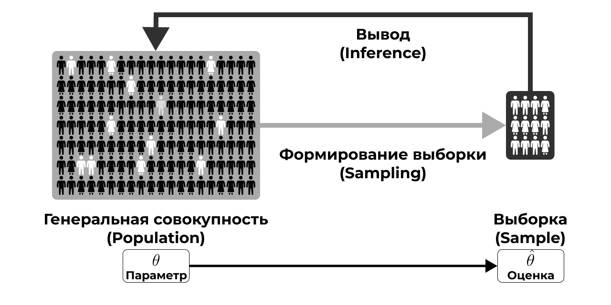

# Основания статистики {#intro-basics}

```{r opts, echo=FALSE, eval=TRUE}
knitr::opts_chunk$set(echo = FALSE, eval = TRUE, warning = FALSE, message = FALSE, error = FALSE)
```

```{r pkgs}
library(tidyverse)
theme_set(theme_bw())
```

## Выборка и генеральная совокупность {#intro-sample-pop}

:::{#def-statistics}
**Статистика (statistics)** --- это междисциплинарная область знаний, а также практической деятельности, изучающая массовые явления, а также принципы и методы работы с данными, характеризующими эти явления.
:::

Звучит красиво. Осталось понять, что это значит.

Массовые явления затрагивают огромные массы людей. Огромность масс, конечно, различна. Скажем, базовые перцептивные закономерности, связанные с тем, как устроена зрительная система, охватывают *всех* людей. Уровень удовлетворенности жизнью россиян охватывает только *население России*. Городские блага москвичей --- только для *жителей Москвы*. Учебная мотивация студентов департамента психологии НИУ ВШЭ --- это только про *людей с психологических бакалавриата и магистратур НИУ ВШЭ*.

:::{#def-population}
**Генеральная совокупность (population)** --- множество всех исследуемых объектов, а также сведения о них.
:::

:::{#def-population-size}
**Объем совокупности** ($N$) --- число единиц, образующих совокупность.
:::

Здесь необходимо уточнить, в каком смысле мы пониманием «*множество*» и «*исследуемых объектов*». Под множеством мы имеем в виду множество в математическом смысле --- некий абстрактный мешок, в которым лежат изучаемые нами объекты. Это действительно абстрактная структура, поскольку вряд ли мы когда-нибудь увидим *все* исследуемые объекты. И дело здесь не только в том, что их много. Чаще всего это так, но ведь изучая, скажем, учебную мотивацию студентов, мы заинтересованы не только в том, чтобы что-либо сказать о мотивации нынешних студентов --- мы хотели бы, чтобы полученное знание обобщалось и на будущих студентов. Но мы не можем включить в исследование будущих студентов, потому что здесь-сейчас-сегодня они ещё не студенты. Таким образом, генеральная совокупность для нас *принципиально недостижима* в полном объёме.

Ввиду ограниченности времени и денег, а также принципиальной недостижимости генеральной совокупности целиком, приходится из генеральной совокупности извлекать **выборку (sample)** --- некоторую часть нашей генеральной совокупности (объемом $n$). При этом $n \ll N$ (много меньше).

Нас, конечно же, интересуют какие-то *признаки*, которыми обладают объекты нашей генеральной совокупности. Эти признаки могут быть выражены количественно в определенных *показателях* (@tbl-param-exmpl).

:::{#tbl-param-exmpl}
|Признак|Показатель|
|:---|:---|
|Рабочая память|Объем рабочей памяти|
|Нейротизм|Уровень нейротизма по BFI|
|Заработная плата|Средняя заработная плата|
|Когнитивная нагрузка|Уровень когнитивной нагрузки по ЭЭГ-коррелятам|
|Доверие к ИИ|Уровень доверия к ИИ по опроснику TAIA|
|Индивидуализм/коллективизм|Индекс индивидуализма/коллективизма по модели Хофстеде|

Примеры признаков и показателей
:::

Признаки могут быть очень разными, как и показатели, которыми мы их пытаемся измерить. Не будем сильно в это углубляться, ибо подробнее об этом будет рассказано в других курсах. Что нам важно сейчас: генеральная совокупность характеризуется *параметром*.

:::{#def-parameter}
**Параметр (statistical parameter)** ($\theta$) --- относительно постоянная [от одной совокупности к другой] величина, характеризующая генеральную совокупность по некоторому показателю.
:::

Ну, то есть в принципе существует средний уровень нейротизма студентов-психологов, или средняя удовлетворенность условиями труда сотрудниками IT-компаний, или средний уровень академической мотивации выпускников бакалавриата. Проблема в том, что *величина параметра*, который мы изучаем, *неизвестна*. *И никогда не будет известна*.

Но почему?

- Мы не можем изучить всю генеральную совокупность
- Наши измерения всегда содержат ошибку --- мы даже длину линейкой точно не можем измерить, что уж о психологических измерениях говорить

Поэтому величину параметра мы можем только *предсказать* с определённой точностью по *выборочной характеристике, или оценке*, полученной на выборке.

:::{#def-estimation}
**Выборочная оценка (estimation)** ($\hat \theta$) --- эмпирический (измеримый) аналог параметра.
:::

Так, оценкой для среднего уровня нейротизма студентов-психологов может служить средний балл нескольких тысяч студентов-психологов по соответствующей шкале опросника BFI (Big Five Inventory), а оценкой для средней академической мотивации выпускников бакалавриата будет, например, средний балл нескольких тысяч выпускников по опроснику академической мотивации.

> Выше приводились примеры, где в качестве параметров и их оценок выступали *средние*. Чаще всего мы в психологии действительно работаем со средними [арифметическими], однако в других науных областях могут встречаться и более хитрые параметры и оценки.


## Основная задача статистики {#intro-main-task}

Мы в какой-то малоприятной ситуации… Мы пытаемся измерить то, что в определенном смысле невозможно измерить, при этом достаточно точно, чтобы потом это можно было сравнивать или строить какие-то модели. Задача выглядит заведомо провальной…

Однако именно в этот момент на помощь нам приходит статистика. Не в гордом одиночестве, конечно. Она приводит с собой теорию вероятности, теорию измерений, психометрику, теорию обнаружения сигнала и др. Всё это работает в нашей психологической науке в комплексе. Мы же в данном курсе сосредотачиваемся на статистической части этого салата.

Статистика даёт нам теоретический и математический инструментарий, чтобы мы могли делать какие-либо выводы о генеральной совокупности по собранным на выборке данным. К сожалению, как бы нам не хотелось, мы *не можем делать выводы по сырым данным*, потому что измерения по выборке не отражают вот прям ровно то, что есть в генеральной совокупности. Нам их надо определенным образом обсчитать, чтобы наши выводы были корректными. Этим и занимается статистика.

Если мы попытаемся нарисовать какую-то концептуальную схему работы с выборкой в ходе исследования, то получится нечто такое (@fig-sampling-inference).

:::{#fig-sampling-inference}


Схема работы с выборкой в ходе исследования
:::

Мы желаем изучить некую **генеральную совокупность (population)**, которая недоступна нам в полном объёме. По этой причине мы извлекаем (sampling) из неё **выборку (sample)**. На выборке мы собираем **данные (data)**, по которым хотим делать **вывод (inference)** о генеральной совокупности. Как именно нам сделать такой вывод и рассказывает статистика.

Вероятно, сейчас это звучит достаточно абстрактно, но на данном этапе будет достаточно некоторого интуитивного понимания того, зачем нужна статистика. Далее интуиция обрастёт содержанием и уложится, хотелось бы надеяться, в достаточно стройную систему.

:::{.callout-note}
### Итог

**Cтатистика помогает нам делать выводы об изучаемой генеральной совокупности по выборке.**
:::


## Основная характеристика выборки {#intro-main-sample}

Окей, статистика даёт нам теоретический и математический аппарат, который позволяет делать выводы о генеральной совокупности по выборке. Однако если мы криво собрали данные, то никакая математика нас не спасет от некорректных выводов.

> Один из принципов машинного обучения, актуальный и для нас, гласит: **garbage in, garbage out**, что значит «плохие данные на входе --- бессмысленные результаты на выходе».

Тогда возникает вопрос: как собрать хорошие данные? Аспектов в этом вопросе много, и все они решаются при разработке дизайна исследования. Мы не будем здесь подробно разбирать, как корректно разрабатывать дизайн исследования, ибо это не является задачей курса статистики. Однако одни из ключевых элементов дизайна любого исследования --- его **выборка и способ её формирования.**

Среди характеристик выборки можно назвать много чего --- например, объём и сбалансированность --- но в целом все отдельные характеристики обобщаются в понятие *репрезентативности*.

**Репрезентативность выборки** --- это степень соответствия характеристик выборки характеристикам генеральной совокупности.

Например, мы хотим исследовать связь учебной мотивации и академической успеваемости бакалавров психологии. Если мы соберем данные *только со своих однокурсников*, будет нехорошо, так как в нашу выборку не попали (1) другие курсы психологического бакалавриата нашего вуза, (2) бакалавры-психологи других вузов Москвы и (3) бакалавры-психологи вузов других городов России.

И так работает всегда.

> Ну, почти. Есть соблазн проводить исследования на студентах-психологах, потому что они достаточно близко и их можно загнать на эксперименты за баллы. Более-менее сносно это может работать на каких-то базовых когнитивных феноменах из восприятия и памяти. Обычно у нас нет оснований предполагать, что восприятие и память работают принципиально по-разному у людей разного возраста и разных социальных страт. Хотя, например, относительно памяти уже надо разбираться в том, что мы конкретно хотим про память изучать. Всё становится сложнее, если мы собираемся изучать что-то более высокоуровневое --- например, мышление --- или феномены личностной или социальной психологии.

**Почему выборка должна быть репрезентативной?**

Потому что если мы делаем нормально, то хотим обобщать результаты нашего исследования, полученные на выборке, на генеральную совокупность. Если выборка нерепрезентативна, то мы не можем этого сделать. Зачем в таком случае проводить исследование --- решительно неясно.

Тогда возникает вопрос: **как собрать репрезентативную выборку?** Можно предложить следующий общий алгоритм.

0. Осознать, кто наша генеральная совокупность.
    - В самом начале этой страницы приводились примеры разных генеральных совокупностей, и для каждой генеральной совокупности репрезентативная выборка будет своя.
1. Понять, есть ли какая-то группировка, важная для нашего исследования, в нашей генеральной совокупности.
    - Социальная страта, специальность образования, сфера работы, пол или гендер, возрастные группы, регион проживания, семейное положение, что-либо ещё.
2. Рассчитать достаточный объём выборки
    - это не самая простая задача, и о ней мы будем говорить отдельно
    - пока отметим в назывном порядке, что на объем выборки будут влиять дизайн исследования, изменчивость признака, уровень значимости и размер эффекта [что бы это ни значило]
3. Обеспечить случайное попадание респондентов в выборку.

На последнем пункте стоит остановиться подробнее. Если у нас есть ресурсы набрать много людей в выборку --- скажем, раза в 2--3 больше, чем достаточный объем выборки --- то можно просто случайным образом откуда-то доставать людей, и всё будет хорошо. Некоторые статистические теоремы говорят, что такой вариант вполне пригоден для обеспечения репрезентативности выборки.

Если мы всё же не можем набрать много людей, то надо набрать выборку достаточного объема и проверить репрезентативна ли она --- отражает ли выборка те группировки изучаемых объектов, которые есть в генеральной совокупности.

Идеальная выборка --- это когда каждый человек имеет *равную вероятность* попасть в число респондентов (или испытуемых). Такая выборка называется **вероятностной (probability sampling)**. Полностью случайный отбор трудно достижим --- это очень дорого --- но к нему нужно стремиться. Кроме того, сам метод сбора данных может деформировать выборку (например, онлайн-опросы отсекают пенсионеров), поэтому думать о сборе данных необходимо уже на этапе планирования исследования.


## Способы формирования выборки {#intro-sampling}

Способов формирования выборки существует много. Для каждого отдельного исследования существующие способы можно модифицировать, что даст нам ещё кучу новых способов. Однако в рамках курса мы рассмотрим три основные способа формирования вероятностной выборки.

### Простая случайная выборка {#intro-simple-random}

В случае **простой случайной выборки (simple random sample)** элементы генеральной совокупности *случайным образом* попадают в выборку. Представим, что на этой картинке изображена вся генеральная совокупность:

```{r simple-random-sample-data}
n_pop <- 600
set.seed(300)
tibble(x = sample(0:1000, n_pop),
  y = sample(0:1000, n_pop),
  little_sample = sample(c(TRUE, FALSE), n_pop, prob = c(1, 9), replace = TRUE),
  # medium_sample = sample(c(TRUE, FALSE), n_pop, prob = c(2, 8), replace = TRUE),
  big_sample = sample(c(TRUE, FALSE), n_pop, prob = c(4, 6), replace = TRUE)) -> data_simple_random_sample
```

```{r simple-random-sample-population}
data_simple_random_sample %>% 
  ggplot(aes(x, y)) +
  geom_point() +
  guides(x = "none",
  y = "none") +
  labs(x = "", y = "")
```

Если мы наберем простую случайную выборку из этой генеральной совокупности, она будет выглядеть так:

```{r simple-random-sample-big}
data_simple_random_sample %>% 
  ggplot(aes(x, y, color = big_sample)) +
  geom_point() +
  scale_color_manual(values = c(`TRUE` = "#000000", `FALSE` = "#E0E0E0")) +
  guides(x = "none",
  y = "none",
  color = "none") +
  labs(x = "", y = "")
```

Как можно заметить, в выборку попали объекты из всех частей нашей генеральной совокупности --- это говорит о том, что выборка репрезентативна.

Простая случайная выборка, конечно, хороша своей простотой, однако у неё есть два существенных недостатка. Во-первых, *действительно случайное попадание респондентов (или испытуемых) в выборку обеспечить практически невозможно* --- всегда будут ограничение на доступ к каким-либо частям генеральной совокупности. Во-вторых, *простая случайная выборка будет репрезентативной только при большом объёме*. Так, если мы посмотрим на простую случайную выборку малого объёма для той жё генеральной совокупности, что была выше, то получим следующее:

```{r simple-random-sample-little}
data_simple_random_sample %>% 
  ggplot(aes(x, y, color = little_sample)) +
  geom_point() +
  scale_color_manual(values = c(`TRUE` = "#000000", `FALSE` = "#E0E0E0")) +
  guides(x = "none",
  y = "none",
  color = "none") +
  labs(x = "", y = "")
```

На рисунке видно, что многие части генеральной совокупности не представлены в выборке, что свидетельсвует о нерепрезентативности выборки.


### Стратифицированная выборка {#intro-stratified}

В случае **стратифицированной выборки (stratified sample)** генеральная совокупность разбивается на несколько обособленных и различных по своей природе групп (страт). В каком смысле обособленных? В том, что каждый объект (респондент, испытуемый) может принадлежать только к одной страте. Например, возрастная группа (дети, подростки, молодежь, взрослые, пожилые), пол, среднемесячный доход семьи и др. Важно отметить, что страта --- это характеристика изучаемых объектов, *важная с точки зрения дизайна исследования*. Ровно поэтому мы хотим учесть её при формировании выборки, обеспечив её репрезентативность по данной характеристике.

Пусть наша генеральная совокупность выглядит как-то так и состоит из четырёх страт:

```{r stratified-sample-data}
set.seed(800)
tibble(x = runif(1500), 
       y = runif(1500), 
       strat = sample(c("A", "B", "C", "D"), 1500, 
                      replace = TRUE, prob = c(.15, .2, .4, .25)),
       smpl = sample(c(TRUE, FALSE), 1500, 
                     replace = TRUE, prob = c(.2, .8))) -> strat_pop
```

```{r stratified-sample-population}
strat_pop %>% 
  ggplot(aes(x, y, 
             color = strat,
             shape = strat)) +
  geom_point() +
  guides(x = "none", y = "none") +
  scale_color_manual(values = RColorBrewer::brewer.pal(4, "Set2")) +
  labs(x = "", y = "", 
       color = "Stratum",
       shape = "Stratum") +
  theme(legend.position = "bottom")
```

Если мы поделим это месиво точек по стратам, то получим следующее:

```{r stratified-sample-strata}
strat_pop %>% 
  ggplot(aes(x, y,
             color = strat,
             shape = strat)) +
  geom_point() +
  scale_color_manual(values = RColorBrewer::brewer.pal(4, "Set2")) +
  facet_wrap(~ strat) +
  guides(x = "none", y = "none", color = "none", shape = "none") +
  labs(x = "", y = "",
       color = "Stratum",
       shape = "Stratum") +
  theme(legend.position = "bottom")
```

Теперь из каждой страты случайным образом выберем несколько объектов, которые и попадут в выборку.

```{r stratified-sample-sampling}
strat_pop %>% 
  ggplot(aes(x, y, 
             color = strat, 
             shape = strat,
             alpha = smpl)) +
  geom_point() +
  scale_color_manual(values = RColorBrewer::brewer.pal(4, "Set2")) +
  facet_wrap(~ strat) +
  guides(x = "none", y = "none", color = "none", shape = "none", alpha = "none") +
  labs(x = "", y = "",
       color = "Stratum", 
       shape = "Stratum") +
  theme(legend.position = "bottom")
```

Относительно количества объектов, извлекаемых из каждой страты, существуют разные варианты. Дизайн исследования может предполагать, что количество респондентов из каждой страты должно быть одинаковым --- тогда мы будем набирать равное количество респондентов из каждой страты. Или же нам может быть важно обеспечить в выборке такое же соотношение между стратами по количеству респондентов, какое существует в генеральной совокупности --- тогда необходимо, зная общий объём выборки, рассчитать количества респондентов из каждой страты, зная пропорции в генеральной совокупности, например, из данных государственной статистики или других источников.


### Групповая выборка {#intro-cluster}

В случае **групповой выборки (cluster sample)** мы разбиваем генеральную совокупность на несколько обособленных, но *одинаковых* групп (кластеров). Обособленный в том же смысле, что и в случае стратифицированной выборки --- один респондент может принадлежать только к одной группе наблюдений. В каком смысле группы тогда должны быть одинаковыми? Они должны быть одинаковыми с точки зрения дизайна исследования. Пусть мы изучаем удовлетворенность городскими благами жителей некоторого города. Группой (cluster) в этом случае может выступить район города, в котором проживает респондент, если у нас нет оснований предполагать, что районы города различаются по характеристике «городские блага». Зачем нам такое разделение может пригодится? Возможно, у нас доступ к организациям городского района, которые могут помочь нам распространить опрос, что снизит затраты на проведение исследования.

Пусть мы разделили нашу генеральную совокупность на шесть кластеров:

```{r cluster-sample-data}
set.seed(800)
n_cluster <- 100
tibble(
  id = 1:n_cluster,
  x1 = rnorm(n_cluster, mean = 1),
  y1 = rnorm(n_cluster, mean = 1),
  x2 = rnorm(n_cluster, mean = 5),
  y2 = rnorm(n_cluster, mean = 5),
  x3 = rnorm(n_cluster, mean = -5),
  y3 = rnorm(n_cluster, mean = -4),
  x4 = rnorm(n_cluster, mean = 6),
  y4 = rnorm(n_cluster, mean = -6),
  x5 = rnorm(n_cluster, mean = -6),
  y5 = rnorm(n_cluster, mean = 5),
  x6 = rnorm(n_cluster, mean = 0),
  y6 = rnorm(n_cluster, mean = -7)
  ) %>% 
  pivot_longer(cols = -id) %>% 
  mutate(cluster = str_extract(name, "\\d$") %>% as.numeric(),
         name = str_remove(name, "\\d$")) %>% 
  pivot_wider() %>% 
  mutate(selected_cluster = ifelse(cluster < 4, TRUE, FALSE),
         selecter_obs = ifelse(selected_cluster, 
                               sample(c(TRUE, FALSE), n_cluster, 
                                      replace = TRUE, prob = c(.3, .7)),
                               FALSE)) -> cluster_pop
```

```{r cluster-sample-population}
cluster_pop %>% 
  ggplot(aes(x, y)) +
  geom_point() +
  guides(x = "none", y = "none") +
  labs(x = "", y = "")
```

Кластеры мы считаем примерно одинаковыми по характеристикам между собой --- по крайне мере, мы так предполагаем с точки зрения дизайна исследования. Выберем случайно три кластера, которые примут участие в исследовании:

```{r cluster-sample-clusters}
cluster_pop %>% 
  ggplot(aes(x, y,
             color = selected_cluster)) +
  geom_point() +
  scale_color_manual(values = c(`TRUE` = "black",
                                `FALSE` = "gray80")) +
  guides(x = "none", y = "none", 
         color = "none") +
  labs(x = "", y = "")
```

Теперь из этих кластеров наберем выборку случайным образом:

```{r cluster-sample-sampling}
cluster_pop %>% 
  ggplot(aes(x, y,
             color = selected_cluster,
             alpha = selecter_obs)) +
  geom_point() +
  scale_color_manual(values = c(`TRUE` = "black",
                                `FALSE` = "gray80")) +
  guides(x = "none", y = "none",
         color = "none", alpha = "none") +
  labs(x = "", y = "")
```

Хотя такой подход к формированию выборки позволяет экономить драгоценные временные и денежные ресурсы, он имеет свои недостатки. В частности, мы должны быть уверенны, что выделенные нами группы действительно одинаковы с точки зрения исследования --- это можно утверждать далеко не всегда.

***

Пока что остановимся на этом --- для первого знакомства со статистикой будет достаточно. Мы еще не раз будем возвращаться к этим вопросам, и на других курсах вы тоже будете говорить о репрезентативности выборки.
 
