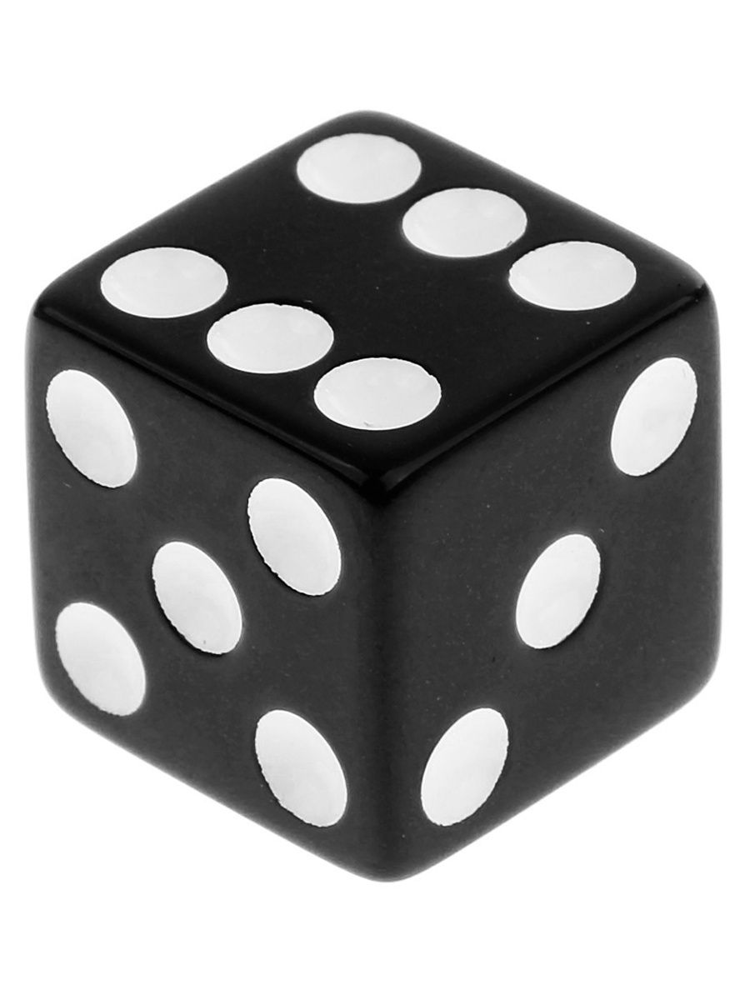

# Измерения. Шкалы. Случайные величины {#prob-randvals}

```{r opts, echo=FALSE, eval=TRUE}
knitr::opts_chunk$set(echo = FALSE, eval = TRUE, warning = FALSE, message = FALSE, error = FALSE)
```

```{r pkgs}
library(tidyverse)
theme_set(theme_bw())
```

Вспомним, что

* статистика нам помогает делать *выводы о генеральной совокупности* на основании *данных, собранных на выборке*
* мы хотим изучать *параметры генеральной совокупности*, но они *неизвестны* и никогда не будут известны
* поэтому мы *используем выборочные характеристики (оценки)*, которые мы *измерили* на нашей выборке

Теперь бы понять, что такое измерение…


## Измерение в социальных науках {#randvals-measure}

Измерение мы будем определять так:

:::{#def-measurement}
**Измерение (measurement)** --- это приписывание признакам объектов изучаемой совокупности определенных значений на определенной шкале.
:::

Еще раз:

* есть совокупность объектов, которые мы изучаем --- выборка,
* в ней есть какие-то объекты,
* у объектов есть признаки,
* если мы приписали признаку какое-то значение на некоторой шкале, значит мы *измерили* данный признак.

Такое определение нам позволяет измерить практически всё, что угодно:

* рост
* возраст
* пол (шкала из двух значений `male` и `female`)
* национальность
* количество детей в семье
* рейтинг студентов
* курс обучения или уровень образования
* географические координаты (долгота и широта)
* температура
* дата
* IQ
* нарциссизм / макиавеллизм / психопатия
* время реакции
* точность ответов испытуемого в эксперименте
* и т. д.

Сейчас нас не интересует, как именно «внутри себя» происходит процесс измерения, какие предположения стоят за различными измерениями и как сделать измерение качественным. Об этом подробно рассказывается в курсах когнитивной и экспериментальной психологии, психодиагностики и психометрики и других. Отметим только, что, конечно же, нам как исследователям надо следить за тем, насколько адекватные измерения мы имеем, насколько приписанные значения отражают выраженность, например, психологических черт, или насколько измеряемые (зависимые) экспериментальные переменные адекватны исследовательским задачам.

Итак, у нас есть интересующие нас признаки генеральной совокупности, которые мы измерили на выборке, то есть приклеили на них некоторые значения из определенных шкал. Успех!

Но тут, пожалуй, разумно задуматься про шкалы. Ведь очевидно, что возраст и пол будут измеряться по-разному, также как и нарциссизм и время реакции.


## Признаки и переменные {#randvals-variables}

Мы уже упомянули выше, что мы можем измерять различные признаки. Попытаемся как-то эту кучу систематизировать. В терминах *данных* признаки --- это *переменные*, поэтому далее мы будем чаще употребляться именно этот термин --- переменная --- имея в виду то, что мы намерили, изучая признак. Во многом признак и переменная --- это синонимы, только первый термин больше из теории измерений, а второй --- из статистики и анализа данных. Измерение же от отдельного человека (объекта выборки) называется *наблюдение*.

:::{.callout-note}
### Типы переменных

- **Количественные переменные** --- те, которые принимают числовые значения
    - **непрерывные** --- принимают любые значения (рост, возраст, время реакции и др.)
    - **дискретные** --- могут принимать только определенные значения (количество детей в семье, число отчисленных студентов, количество стаканов кофе, выпитых в ночь перед экзаменом и др.)

Число, приписываемое количественному признаку (переменной) ведёт себя как привычное нам математическое число в том смысле, что выражает некоторое количество --- сантиметров, лет, секунд, детей, студентов, стаканов кофе…

- **Номинальные (категориальные) переменные** --- используются для разделения наших наблюдений на группы (пол, национальность, курс обучения, используемая операционная система компьютера и др.).
    - Записаны эти переменные обычно текстом (скажем, как в примерах выше, пол --- `male` и `female` --- или операционная система --- `Win`, `macOS`, `Linux`).
    - Однако, например, курс обучения можно записать по-разному: текстом --- `freshman`, `sophomore`, `junior`, `senior` --- или числом --- `1`, `2`, `3`, `4`. Однако в данном случае числа не несут никакого математического смысла --- это просто *лейблы*, с помощью которых мы различаем группы наблюдений. Ведь и пол мы можем записать с помощью чисел --- пусть `male = 0`, `female = 1`. Ведь не будем же мы складывать-вычитать девушек и парней?

:::

Внимательный читатель мог заметить, что курс обучения --- это не совсем категориальная переменная, ведь «второкурсник» в каком-то смысле «больше», чем «первокурсник». Но мы не можем сказать «на сколько» или «во сколько» больше! Что же делать?

:::{.callout-note}
### Ранговые переменные

- Нельзя сказать, что «второкурсник» выражает бо́льшую выраженность признака «год обучения», чем «первокурсник».
- Вместе с тем «второкурсник» дольше учился и освоил больше дисциплин, чем «первокурсник». При этом «третьекурсник» учился дольше «второкурсника» --- то есть существует *порядок* категорий.
- Такая переменная называется **ранговой**.

:::

Другой пример ранговой переменной --- это студенческий рейтинг. Что делает рейтинг? Упорядочивает студентов. Можно ли сказать, что четвертый в рейтинге студент в два раза менее успешен, чем второй? Нет --- тот же GPA может отличаться на десятые или сотые доли.

Итого, классификацию переменных можно представить так (@fig-type-of-vars):

```{mermaid}
%%| label: fig-type-of-vars
%%| fig-cap: Классификация переменных
%%| fig-align: center

flowchart TD
  vars("Переменные")
  quantitative("Количественные")
  discrete("Дискретные")
  continuous("Непрерывные")
  rank("Ранговые")
  nominal("Номинальные")
  
  vars --> quantitative
  vars --> rank
  vars --> nominal
  quantitative --> discrete
  quantitative --> continuous
```


## Шкалы {#randvals-scales}

### Зачем нам знать виды шкал? {#randvals-scales-why}

От того, в какой шкале измерена переменная, которую мы исследуем, будет зависеть:

* какие графики мы сможем нарисовать
* какие статистики на ней имеют смысл
* какие статистические модели дадут адекватный результат

В общем, почти весь анализ определяется[^andan-defined] тем, с какой шкалой мы работаем.

[^andan-defined]: Разумеется, с учетом поставленного исследовательского вопроса и выдвинутых гипотез.

Что же такое шкала?

:::{#def-scale}
**Шкала (scale)** --- это набор допустимых значений переменной с ограничениями на допустимые операции над этими значениями.
:::

Вновь посмотрим на признаки, которые мы можем измерять. Пол имеет два допустимых значения --- `male` и `female` --- и мы можем лишь сравнить значения, проверив, совпадают они или нет. В то же время, рассматривая переменную «время», которая может принимать значения от $0$ до $+\infty$, мы уверенно можем утверждать, что если одна пара длится 120 минут, то две будут длиться 240 минут --- мы можем считать сумму значений по этой переменной.

Можно ли как-то систематизировать все возможные варианты допустимых значений и операций?


### Типы и виды шкал {#randvals-scales-types}

Всего выделяют четыре вида шкал (@tbl-scales-types).

:::{#tbl-scales-types}
|Шкала|Тип шкалы|Тип данных|Допустимые операции|Ноль|Допустимые преобразования|
|:---|:---|:---|:---|:---|:---|
|Номинальная (номинативная, nominal scale)|Неметрическая|~~Качественные~~ Категориальные|$=$, $\neq$|Отсутствует|---|
|Порядковая (ранговая, ordinal scale)|Неметрическая|~~Качественные~~ Категориальные (?) Ранговые|$=$, $\neq$, $>$, $<$|Отсутствует|Монотонное преобразование|
|Интервальная (шкала разностей, interval scale)|Метрическая|Количественные|$=$, $\neq$, $>$, $<$, $+$, $-$|Относительный|Линейное преобразование|
|Абсолютная (шкала отношений, ratio scale)|Метрическая|Количественные|$=$, $\neq$, $>$, $<$, $+$, $-$, $\times$, $\div$|Абсолютный|Преобразование подобия|

Виды шкал изменения
:::

Пройдёмся по колонкам этой таблицы.

* **Тип шкалы** --- *метрическая* или *неметрическая* --- определяется тем, одинаково расстояние между делениями шкалы или же нет. Иначе, есть ли на шкале цена деления.
    * Так, понятно, что на шкале времени реакции все секунды одинакового размера --- метрическая шкала.
    * А на шкале «используемая операционная система» вообще нет делений, не то что расстояний.
    * Обратите внимание, что на ранговой шкале хотя и есть деления (например, шкала Ликерта), их размер неодинаковый: нельзя сказать[^liker-assumption], что $6$ на шкале Ликерта в два раза или на три больше, чем $3$. Поэтому ранговая шкала --- неметрическая.
* **Тип данных** --- количественные или категориальные --- определяется тем, какие свойства чисел работают на этой шкале.
    * Чтобы не утонуть в математической части этого всего, соотнесём это с колонкой допустимые операции.
        * На *количественных* шкалах допустимы операции сложения, вычитания, умножения и деления.
        * На *категориальных* шкалах шкалах допустимы только операции сравнения.
* **Ноль**
    * На *номинальной* и *порядковой* шкалах нуля в математическом смысле нет вовсе.
        * Для номинальной шкалы это очевидно, потому что там вообще нет «чисел» --- там только лейблы.
        * Для порядковой шкалы, в определенной мере, тоже, потому что $0$ на ней будет обозначать только то, что ранг у этого наблюдения ниже, чем ранг у наблюдения с $1$. Ничего другого этот ноль не обозначает.
    * На *интервальной* и *абсолютной* шкалах ноль есть.
        * Классический пример интервальной шкалы --- это температура в градусах Цельсия. Ноль на этой шкале --- температуре замерзания воды --- выбран произвольно. Ну, потому что это было достаточно удобно. Больше этот ноль ничем не обоснован.
            * Поскольку ноль относительный, на такой шкале могут быть отрицательные значения --- с температурой по Цельсию нас это совершенно не удивляет.
        * Классический пример абсолютной шкалы --- это температура по Кельвину. Известно, что на этой шкале не бывает отрицательных значений, так как минимум этой шкалы --- это минимально возможная температура во Вселенной. Ниже не бывает. Поэтому это абсолютный ноль.
* **Допустимые операции**
    * Наличие *относительного* нуля даёт возможность складывать и вычитать.
    * Наличие *абсолютного* нуля даёт возможность складывать, вычитать, делить и умножать.
    * На *номинальной* и *порядковой* шкалах нуля нет, поэтому арифметические действия на них невозможны.
    * На *номинальной* шкале допустимо только сравнение на [не]равенство --- мы можем только проверить, одинаковы ли наблюдения [по этой переменной] или не одинаковые.
    * На *порядковой* шкале, помимо сравнения на [не]равенство, допустимо также сравнение на больше-меньше, так как задан порядок.
* **Допустимые преобразования**
    * Отсюда нам нужно попытаться понять, что такое монотонное преобразование. Это любое преобразование, сохраняющее порядок элементов.
        * Например, у нас есть шкала Ликерта от 1 до 5 --- `[1, 2, 3, 4, 5]`. Шкала Ликерта --- порядковая, поэтому мы можем утверждать, что `1 < 2 < 3 < 4 < 5`.
        * Пусть мы психометрик и собираемся вычислять психометрические штуки на таких данных. Для удобства нам надо сделать так, чтобы шкала начиналась с нуля.
            * Кажется, надо просто вычесть единицу из всех наблюдений --- но законно ли это? Не сломаются ли закономерности наших данных?
        * Да, законно, потому что вычитание единицы --- это монотонное преобразование. И хотя значения переменной изменятся --- `[0, 1, 2, 3, 4]` --- порядок значений сохранится --- `0 < 1 < 2 < 3 < 4`.

[^liker-assumption]: Относительно шкалы Ликерта, активнейшим образом используемой в психометрике, делаются некоторые допущения о её *квазинепрерывности* и *псевдоинтервальности*. Однако это вопросы курса психометрики, и пока что мы в них погружаться не будем.


:::{.callout-note appearance="simple"}
#### О термине «качественные данные»

Почему-то номинальную и ранговую шкалы в литературе часто называют «качественными». Видимо, потому что качественные данные обычно рассматриваются как оппозиция количественным.

Это в некоторой мере справедливо, поскольку есть два типа исследований --- качественные и количественные. Они различаются методологией и используемыми методиками и, как следствие, собираемыми данными.

В рамках качественных исследований чаще всего собираются тексты, поэтому во многом качественные данные обычно текстовые. Количественные данные --- это, как правило, таблицы с цифрами из любой из четырёх шкал. Безусловно, анализ качественных и количественных данных также существенно различается.

Итого, кажется, что называть «качественными» номинальную и ранговые шкалы --- странно, потому что качественные данные --- это неструктурированный текст. Лучше их именовать категориальными. Правда, например, рейтинг студентов (ранговая шкала) тоже не совсем категориальные данные. Такая переменная, конечно, делит наших респондентов на категории (группы), однако между этими группами определён порядок --- больше-меньше --- поэтому такие переменные называются ранговыми.
:::


### Порядок шкал по мощности {#randvals-scales-order}

Если взять за основу допустимые операции, можно упорядочить шкалы по мощности --- более мощной является та шкала, на которой допустимо больше операций. Тогда шкалы можно упорядочить так:

$$
\text{номинальная} < \text{порядковая} < \text{интервальная} < \text{абсолютная}
$$

Наименее мощная --- номинальная, наиболее мощная --- абсолютная. Что нам надо вынести из этой иерархии? То, что мы можем по ней двигаться только *влево*. Если переменная измерена в абсолютной шкале, то мы можем сделать её порядковой или номинальной. Если же переменная изначально номинальная, то перейти в порядковую или интервальную шкалу невозможно.

Например, вот такой нехитрый пример (@tbl-scale-order):

:::{#tbl-scale-order}
|Возраст [абсолютная]|Возраст [ранговая]|Возраст [номинальная]|
|:---:|:---:|:---:|
|86|пенсионер|совершеннолетний|
|43|взрослый|совершеннолетний|
|38|взрослый|совершеннолетний|
|22|молодой|совершеннолетний|
|16|подросток|несовершеннолетний|
|10|ребёнок|несовершеннолетний|
|8|ребёнок|несовершеннолетний|

Одна и та же переменная, измеренная в разных шкалах
:::

В психологии чаще всего мы сталкиваемся с порядковыми шкалами. Это просто факт. Надо его принять.


## Случайные величины {#randvals-randvals}

Ещё раз:

* Измерение --- это *приписывание* признакам объектов изучаемой совокупности определенных значений на определенной *шкале*.

Со шкалой разобрались. Теперь надо разобраться с приписыванием. Мы будем рассматривать этот вопрос только с точки зрения статистики --- теорию измерений не трогаем.


### Случайный эксперимент {#randvals-randexp}

Отвлечемся на любимый объект статистиков --- игральный кубик.

{width="20%" fig-align=center}

Скажем просто:

* Бросание игрального кубика --- это *случайный эксперимент*,
* Выпавшее число --- это *случайная величина*.

Теперь более строго.

:::{#def-randexp}
**Случайный эксперимент (random experiment)** --- это математическая модель некоторого реального эксперимента, результат которого невозможно точно предсказать.
:::

В каком смысле то, что мы называем сейчас экспериментом, случайно? В том, что результат такого эксперимента точно неизвестен. В частности, заранее неизвестно, какой стороной упадёт кубик при отдельном броске.

:::{#def-randval}
**Случайная величина (random variable)** --- это некоторая переменная, значения которой представляют собой численные исходы некоторого случайного эксперимента.
:::

Исход бросания кубика --- выпавшее число.

Из психологического поля можно привести следующие примеры:

* в опросных (психометрических) исследованиях:
    * ответ респондента на пункт опросника --- это случайный эксперимент
    * выбранный им балл на шкале Ликерта --- это случайная величина
    * в чём случайность? --- неизвестно, какой балл выберет респондент
* в поведенческих экспериментах:
    * клик на стимул на экране в эксперименте зрительного поиска --- это случайный эксперимент
    * время реакции, которое фиксирует PsychoPy --- случайная величина
    * в чём случайность? --- неизвестно, когда точно испытуемый кликнет по стимулу
* в нейроисследованиях:
    * запись ЭЭГ-активности в конкретный момент времени --- случайный эксперимент
    * амплитуда колебаний ЭЭГ --- случайная величина
    * в чём случайность? --- неизвестно, что мы зафиксируем в конкретный момент (в частности, потому что существуют технические шумы)
* и т. д.


:::{.callout-note appearance="simple"}
#### Случайный эксперимент vs эксперимент как метод исследования

Обратим внимание на то, что *случайный* эксперимент --- это не то же самое, что *эксперимент как метод исследования*, изучаемый в рамках курса экспериментальной психологии. Случайный эксперимент происходит *в момент измерения* какой-либо переменной в рамках эксперимента.

Посмотрим на примеры, приведённые выше. У нас есть поведенческий эксперимент, в котором существуют независимы и зависимые переменные, определённое количество проб на конкретное сочетание экспериментальных условий и другие аспекты дизайна эксперимента. Однако в процессе сбора данных в рамках этого исследования происходит множество случайный экспериментов, когда испытуемые проходят эксперимент. В каждой пробе осуществляется измерение зависимых переменных, и каждое такое измерение является случайным экспериментом, так как ответ испытуемого (координаты клика или время нажатия на клавишу) нельзя однозначно предсказать.
:::

Итого, мы постоянно имеем дело со случайными экспериментами в рамках любых исследований, но также, что более важно, по результатам этих случайных экспериментов [в рамках нашего эксперимента или заполнения опросника] мы собираем значения случайных величин. Вся статистика работает со случайными величинами.


### Случайная величина {#randvals-randval}

Попробуем ещё такой заход. Вот мы тут говорим об измерениях признаков/переменных. Эти переменные и есть случайные величины, которые мы измеряем. Случайные --- потому что мы никогда не знаем, что же мы получим в конкретном измерении.

**Почему не знаем?**

Если у нас «хардовое» измерение (типа ЭЭГ или PsychoPy) --- всегда есть погрешность измерения и «шум» в данных. Мы не можем предусмотреть всё и сделать так, чтобы нашего испытуемого ничего не отвлекало, он занимался только экспериментальной задачей, не думал о коте, который остался дома, или испытывал блаженство от ЭЭГ-шной шапочки на себе.

Если это опросник --- всё, вроде бы, ещё понятнее. Что нам именно сейчас отметит именно этот респондент --- известно только одному никому. В каком состоянии он пришёл, какие у него личностные черты и свойства, насколько он нам доверяет, насколько он готов отвечать честно и т. д.

К вопросу, зачем нам статистика и анализ данных --- чтобы отделить случайности от закономерностей, которые нас интересуют как исследователей, и получить ответы на исследовательские вопросы.

Случайные величины бывают дискретные и непрерывные:

* **непрерывные** --- принимают любые значения (рост, возраст, время реакции и др.)
* **дискретные** --- могут принимать только определенные значения (пол, город проживания, балл по шкале Ликерта и др.)

:::{.callout-note appearance="simple"}
#### Переменные vs Шкалы vs Случайные величины

Мы обозначили три понятия --- переменные, шкалы и случайные величины --- которые выглядят очень похоже друг на друга. Тем не менее, они не являются синонимами. Давайте разберемся в различиях между ними. Для этого рассмотрим следующие примеры.

|Переменная|Тип переменной|Шкала|Случайная величина|
|:---|:---|:---|:---|
|Пол|Номинальная|Номинальная|Дискретная|
|Уровень образования|Номинальная / Ранговая|Номинальная / Порядковая|Дискретная|
|Балл по шкале Ликерта|Ранговая|Порядковая|Дискретная|
|Количество детей в семье|Количественная дискретная|Абсолютная|Дискретная|
|Температура по Цельсию|Количественная непрерывная|Интервальная|Непрерывная|
|Температура по Кельвину|Количественная непрерывная|Абсолютная|Непрерывная|
|Время реакции|Количественная непрерывная|Абсолютная|Непрерывная|

Таким образом, можно наблюдать, что хотя эти понятия в некоторой мере пересекаются, всё же существуют различия между этими тремя терминами.
:::

Зачем нам различать дискретные и непрерывные случайные величины? Это различение оказывается критически важно, когда мы пытаемся математически описать случайные величины. Оказывается, что они по-разному ведут себя в отношении вероятности.


### Вероятность {#randvals-prob}

Математически строгое введение понятия вероятности требует отдельного курса теории вероятности, которого у нас нет. Мы ограничимся во многом интуитивным пониманием вероятности, которого, в целом, для наших задач будет достаточно.

Под **вероятностью (probability, $\mathbb{P}$)** мы будем понимать меру возможности наступления некоторого события. *Событием* будем считать наблюдение (измерение) определённого значения случайной величины. Рассмотрим всю эту ситуацию на примерах дискретных и случайных величин.


### Дискретные случайные величины {#randvals-discrete}

С дискретными случайными величинами все достаточно просто:

* есть *ограниченный* набор значений, которые случайная величина может принимать,
* есть *вероятности*, с которыми случайная величина принимает эти значения.

Давайте на игральном кубике. Есть кубик --- у него шесть граней. Возможные значения случайной величины $X$ --- $\{1,2,3,4,5,6\}$. Вероятность того, что кубик упадет хотя бы какой-то из шести сторон --- $1$. Если кубик «честный», то каждая из граней выпадает равновероятно, то есть вероятность, с которой наша случайная величина принимает каждое из своих значений будет равна

$$
\mathbb{P}(X=1) = \mathbb{P}(X=2) = \mathbb{P}(X=3) = \mathbb{P}(X=4) = \mathbb{P}(X=5) = \mathbb{P}(X=6 ) = \frac{1}{6} \approx 0.167
$$

Но это мы рассчитали теоретически. Давайте проверим, будет ли это работать эмпирически. Подбросим кубик (на симуляции) 100 раз и посмотрим, сколько раз выпало та или иная грань (@tbl-dice-100).

:::{#tbl-dice-100}
```{r dice-100}
set.seed(123)
sample(1:6, 100, replace = TRUE) %>% 
  table() %>% 
  as_tibble() %>% 
  rename("x" = ".") -> dice100

dice100 %>% 
  mutate(p = (n / 100) %>% round(3) %>% as.character(),
         n = n %>% as.character()) %>% 
  pivot_longer(cols = -x) %>% 
  pivot_wider(names_from = x,
              values_from = value) %>% 
  mutate(name = recode(name,
                       "n" = "Частота",
                       "p" = "Вероятность")) %>% 
  rename("Значение" = "name") %>% 
  knitr::kable()
```

Результаты симуляции 100 бросков игрального кубика
:::


Внимание, мы построили **таблицу частот**, она же частотная таблица. Это способ описания поведения дискретной случайной величины в эксперименте.

Можем ли мы это каким-то образом визуализировать? Да.


:::{#fig-dice-100}
```{r dice-100-plot}
dice100 %>% 
  ggplot(aes(x, n)) +
  geom_col() +
  labs(x = "Значение",
       y = "Частота")
```

Визуализация частоты выпадения значений при 100 бросках игрального кубика
:::


Вниманием --- **столбчатая диаграмма (barplot)**. Как видите, по оси $x$ идут значения нашей случайной величины, по оси $y$ --- частота, с которой случайная величина принимает данной значение. Изи.

Но погодите, кубик должен падать одинаково часто на каждую из граней, а на графике частоты разные. Да, это правда. Как мы уже не раз упоминали, в данных всегда есть шум и ни один эксперимент не может пройти идеально. В том числе и симуляция. Поэтому те отклонения, которые мы видим на графике, это всего лишь шум --- то, что нам нерелевантно.

Чтобы убедиться, что кубик все-таки честный, давайте подкинем его 1000 раз.

:::{#tbl-dice-1000}
```{r dice-1000}
set.seed(123)
sample(1:6, 1000, replace = TRUE) %>% 
  table() %>% 
  as_tibble() %>% 
  rename("x" = ".") -> dice1000

dice1000 %>% 
  mutate(p = (n / 1000) %>% round(3) %>% as.character(),
         n = n %>% as.character()) %>% 
  pivot_longer(cols = -x) %>% 
  pivot_wider(names_from = x,
              values_from = value) %>% 
  mutate(name = recode(name,
                       "n" = "Частота",
                       "p" = "Вероятность")) %>% 
  rename("Значение" = "name") %>% 
  knitr::kable()
```

Результаты симуляции 1000 бросков игрального кубика
:::

:::{#fig-dice-1000}
```{r dice-1000-plot}
dice1000 %>% 
  ggplot(aes(x, n)) +
  geom_col() +
  labs(x = "Значение",
       y = "Частота")
```

Визуализация частоты выпадения значений при 1000 бросках игрального кубика
:::

Хм… Больше бросков!

:::{#tbl-dice-100000}
```{r dice-100000}
set.seed(123)
sample(1:6, 100000, replace = TRUE) %>% 
  table() %>% 
  as_tibble() %>% 
  rename("x" = ".") -> dice100000

dice100000 %>% 
  mutate(p = (n / 100000) %>% round(3) %>% as.character(),
         n = n %>% as.character()) %>% 
  pivot_longer(cols = -x) %>% 
  pivot_wider(names_from = x,
              values_from = value) %>% 
  mutate(name = recode(name,
                       "n" = "Частота",
                       "p" = "Вероятность")) %>% 
  rename("Значение" = "name") %>% 
  knitr::kable()
```

Результаты симуляции 100 000 бросков игрального кубика
:::

:::{#fig-dice-100000}
```{r dice-100000-plot}
dice100000 %>% 
  ggplot(aes(x, n)) +
  geom_col() +
  labs(x = "Значение",
       y = "Частота")
```

Визуализация частоты выпадения значений при 100 000 бросках игрального кубика
:::

Ну, почти. Нивелировать шум полностью нам не удастся никогда, поэтому будем считать, что мы достаточно убеждены, что кубик честен.

То, что мы сейчас с вами строили --- в таблице или на графике --- называется **распределением случайной величины (distribution of a random variable, probability distribution)**. Распределение --- это некоторый закон, который полностью описывает поведение случайной величины.

Итак, мы сейчас обсудили как строить *эмпирическое* распределение нашей дискретной переменной. А как нам построить теоретическое распределение нашей случайной величины? Для этого нам нужно взять две оси --- $x$ и $y$. По оси абсцисс расположить значения нашей случайной величины, по оси ординат --- вероятности, с которыми наша случайная величина принимает данные значения. 

Выглядит это так:

:::{#fig-pmf-unif}
```{r pnf-unif}
tibble(x = 1:6,
       y = 1/6) %>% 
  ggplot(aes(x, y)) +
  geom_point(size = 2) +
  scale_x_continuous(breaks = 1:6) +
  labs(x = "X", y = "P(X)")
```

Функция вероятности дискретного равномерного распределения
:::

То, что изображено на рисунке, называется **функцией вероятности (probability mass function, PMF)** дискретного равномерного распределения.

Для порядка также скажем, что дискретные случайные величины вовсе не обязательно распределены равномерно. Например, есть такое распределение:

:::{#fig-pmf-binom}
```{r pnf-binom}
tibble(x = 1:30,
       y = dbinom(x, size = 30, prob = .3)) %>% 
  ggplot(aes(x, y)) +
  geom_point(size = 2) +
  scale_x_continuous(breaks = 1:30) +
  labs(x = "X", y = "P(X)")
```

Функция вероятности биномиального распределения
:::

Вообще распределений существует [довольно много](https://www.math.wm.edu/~leemis/chart/UDR/UDR.html). Мы в рамках этого курса познакомимся далеко не со всеми --- только с теми, которые нам пригодятся для решения наших задач.


### Непрерывные случайные величины {#randvals-continuous}

Окей, с дискретными разобрались. С непрерывными же всё то же самое?

Не совсем. Есть один ключевой момент, который всё портит.

Мы говорили, что дискретные случайные величины могут принимать только некоторые значения, например, целочисленные --- $1, 2, 3, -5, 0$… Их можно посчитать и сопоставить им вероятности, с которыми случайная величина принимает эти значения.

Чуть выше мы разобрались с дискретным равномерным распределением. Давайте попробуем применить аналогичные размышления для *непрерывного равномерного распределения*.

Пусть мы случайным образом выбираем 1000 чисел из отрезка $[0,1]$, считая что все числа могут попасться равновероятно. Займемся симуляцией и попробуем отобразить частоты, с которыми выпадают числа:

:::{#fig-unif-100}
```{r unif-100}
set.seed(123)
tibble(x = runif(n = 100)) %>% 
  summarise(n = n(),
            .by = x) %>%
  ggplot(aes(x, n)) +
  geom_point(size = 1,
             alpha = .5) +
  scale_y_continuous(limits = c(0, 2),
                     breaks = 0:2) +
  labs(x = "X", y = "Частота")
```

Визуализация частоты случайного выбора 100 чисел из отрезка $[0, 1]$
:::

Хм… Обратим внимание на некоторую интересность: частота каждого значения --- единица, то есть каждое значение выпало только один раз. Но может это артефакт малого количества случайных экспериментов по выбору чисел? Давайте извлечём 1000.

:::{#fig-unif-1000}
```{r unif-1000}
set.seed(123)
tibble(x = runif(n = 1000)) %>% 
  summarise(n = n(),
            .by = x) %>%
  ggplot(aes(x, n)) +
  geom_point(size = 1,
             alpha = .5) +
  scale_y_continuous(limits = c(0, 2),
                     breaks = 0:2) +
  labs(x = "X", y = "Частота")
```

Визуализация частоты случайного выбора 1000 чисел из отрезка $[0, 1]$
:::

Хм… Ну, может 10 000 исправят ситуацию?

:::{#fig-unif-10000}
```{r unif-10000}
set.seed(123)
tibble(x = runif(n = 10000)) %>% 
  summarise(n = n(),
            .by = x) %>%
  ggplot(aes(x, n)) +
  geom_point(size = 1,
             alpha = .5) +
  scale_y_continuous(limits = c(0, 2),
                     breaks = 0:2) +
  labs(x = "X", y = "Частота")
```

Визуализация частоты случайного выбора 10 000 чисел из отрезка $[0, 1]$
:::

Окак… Всё ещё наблюдаем, что каждое число встретилось в выборке всего один раз. Тогда таблица частот оказывается бессмысленной. Как же нам тогда описать распределение непрерывной случайной величины?

Так, попробуем другой заход. Когда мы считали вероятность того, что на кубике выпадет определенное число, мы взяли все возможные исходы и поделили единицу на их количество --- получили вероятность. Раз мы и сейчас предполагаем равную вероятность выпадения каждого из чисел, то попробуем сделаль тут так же.

> --- Сколько всего чисел на отрезке $[0, 1]$?<br>
--- Бесконечность.

Это что же, получается,

$$
\mathbb{P}(X = a) \overset{?}{=} \frac{1}{\infty}
$$

так что ли? Но это же какой-то сюр! Не совсем.

Не вдаваясь в математические детали, перепишем выражение выше в более математически приличном виде:

$$
\mathbb{P}(X = a) = \lim_{n \to \infty} \frac{1}{n} = 0
$$

Эта запись означает следующее:

:::{.callout-important}
#### Ключевое свойство непрерывных случайных величин

Вероятность того, что непрерывная случайная величина принимает конкретное значение, равна нулю.
:::

Но как это? Ведь числа-то выпадают! Вероятность не может быть равна нулю!

Это справедливо, но чтобы ответить на все вопросы предельно точно, нам придется умереть в математических океанах. Воспользуемся эвристикой. Будем понимать под «вероятность того, что непрерывная случайная величина принимает конкретное значение, равна нулю» следующее:

- Мы не можем ожидать, что беря числа из отрезка $[0, 1]$ мы попадём в какое-то конкретное число, например, $0.5$.
- Даже если попадём во что-то очень похожее, это будет $0.50003$ или $0.4999999999$.
- Ровно $0.5$ никогда не выпадет. В этом смысле вероятность, действительно равна нулю.

Вот такое странное поведение у этих непрерывных величин. И тем не менее, хочется все-таки как-то с ними работать, описывать их поведение.

> --- Зачем? Если они такие странные, а самая используемая в психологии шкала --- порядковая, то мож не будет возиться с этой ерундой? <br>
--- Весь замес в том, что тестирование статистических гипотез, которое есть сердце анализа данных, полностью основано на работе с непрерывными случайными величинами. Всё-таки придётся разбираться.


Да, мы не можем работать с конкретными значениями непрерывных случайных величин --- но **мы можем работать с интервалами на множестве значений.** Так, если нам надо визуализировать распределение непрерывной случайной величины, мы уже не можем использовать barplot --- будет результат подобный рисунку [-@fig-unif-10000]. Вместо этого будем использовать **гистограмму (histogram)**:

:::{#fig-unifhist-10000}
```{r}
set.seed(123)
tibble(x = runif(n = 10000)) %>% 
  ggplot(aes(x)) +
  geom_histogram(color="black")
```

Визуализации распределения чисел, сгенерированных из непрерывного равномерного распределения на отрезке $[0,1]$.
:::

Хм… В общем, мы получили нечто похожее на @fig-dice-100000. Похоже мы движемся в правильном направлении.

:::{.callout-tip}
#### В чем отличие гистограммы от столбиковой диаграммы?

- На столбиковой диаграмме по оси $x$ располагается дискретная переменная --- каждый столбик соотносится с конкретным значением изучаемой переменной.
- На гистограмме же ось $x$ поделена на определенное количество отрезков (на рисунке их 30).
    - В границы каждого отрезка попадает сколько-то сгенерированных нами чисел --- высота столбика отражает количество чисел, попавших в этот отрезок.
    - При этом, в отличие от барплота, количество столбиков не является строго фиксированным (см. [-@fig-unifhist20-10000]).

:::{#fig-unifhist20-10000}
```{r}
set.seed(123)
tibble(x = runif(n = 10000)) %>% 
  ggplot(aes(x)) +
  geom_histogram(bins = 20, color = "black")
```

Визуализации распределения чисел, сгенерированных из непрерывного равномерного распределения на отрезке $[0,1]$ (разбиение на 20 столцов).
:::

:::


Гистограмма обычно используется для отображения эмпирического распределения непрерывной случайной величины. А как же быть с теоретическим?

Вновь мы не можем взять то, что было у дискретных величин --- изобразить график функции вероятности невозможно, поскольку это будет прямая, совпадающая с осью $x$. Возникает необходимость ввести какую-то иную характеристику, связанную с вероятностью, которую можно будет использоваться для описания поведения непрерывных случайных величин.

Вспомним, как выглядел график для дискретного равномерного распределения --- вот так [-@fig-pmf-unif]. Наверное, по аналогии нам бы хотелось, чтобы для рассматриваемого нами *непрерывного* равномерного распределения график выглядел как-то так (@fig-unifcont-draft):

:::{#fig-unifcont-draft}
```{r}
tibble(x = c(0, 1),
      y = c(1, 1)) %>% 
  ggplot(aes(x, y)) +
  geom_line() +
  labs(x = "X",
       y = "") +
  theme(axis.text.y = element_text(size = 0))
```

Схема графика непрерывного равномерного распределения на $[0, 1]$
:::

Визуально действительно выглядит так, что все числа из отрезка $[0, 1]$ выпадают равновероятно. Однако нечто, отображённое на оси $y$ не может быть вероятностью, так как для все значений непрерывной случайной величины вероятность равна нулю.

Если же мы сравним рисунки [-@fig-unifcont-draft] и [-@fig-unifhist-10000], то мы можем заметить, что [-@fig-unifcont-draft] --- это некий идеал для [-@fig-unifhist-10000]. Действительно, если увеличить количество сгенерированных чисел, то гистограмма будет практически идеально ровной.

Гистограмма нам показывает, сколько сгенерированных чисел лежит в определенном диапазоне отрезка, а поскольку мы сказали, что все числа выпадают равновероятно, то и в каждом выделенном диапазоне (столбике гистограммы) должно лежать одинаковое количество чисел. Иначе говоря, числе *одинаково плотно* распределены на всём отрезке.


### Плотность вероятности {#randvals-density}

Идея плотности была взята на вооружение математиками, и они, сильно не заморачиваясь относительно названия, ввели понятие плотности вероятности. Мы не будем давать ей строгого математического определения, ибо оно довольно зубодробительно. Мы порисуем картинки.

Собственно, для непрерывного равномерного распределния график плотности вероятности будет выглядеть именно так, как мы нарисовали --- разве что надо ось $y$ подписать и значение поставить.

:::{#fig-unifcont-pdf}
```{r}
tibble(x = c(0, 1),
      y = c(1, 1)) %>% 
  ggplot(aes(x, y)) +
  geom_line() +
  labs(x = "X",
       y = "Плотность вероятности")
```

График функции плотности вероятности непрерывного равномерного распределения на $[0, 1]$
:::

Полученный график называется **графиком плотности вероятности (probability density function, PDF)**. Нам надо уметь его читать.

По оси $x$ здесь значения нашей случайной величины (как и в случае PMF), а вот по оси $y$ --- эта самая загадочная плотность вероятности. А где же сама вероятность? Раз мы решили работать с интервалами значений, то нас будет интересовать вероятность попадания значений случайной величины в определенный интервал.

:::{.callout-important}
#### Вероятность для непрерывных случайных величин

Вероятность того, что значение непрерывной случайной величины попадёт в заданный интервал определяется как площадь под графиком функции плотности вероятности на этом интервале.
:::

Посмотрим на примере равномерного распределения. Какова вероятность, что случайно выбранное из отрезка $[0,1]$ число попадёт в интервал $(0.25, 0.75)$? Интуитивно кажется, что должно быть $0.5$, так как длина этого интервала --- полочина длины отрезка. Нарисуем.

:::{#fig-unifcont-interval}
```{r}
tibble(x = c(0, 1),
      y = c(1, 1)) %>% 
  ggplot(aes(x, y)) +
  geom_line() +
  stat_function(fun = function(x) 1,
                geom = "area",
                xlim = c(.25, .75),
                alpha = .5) +
  annotate(geom = "text",
           label = "P = 0.5",
           x = .5, y = .5) +
  labs(x = "X",
       y = "Плотность вероятности")
```

Вероятность попадания случайного числа из непрерывного равномерного распределения на $[0,1]$ в интервал $(0.25, 0.75)$
:::

Воистину площадь полученного прямоугольника равна $0.5$. Значит, схема работает.

Работать с равномерным распределением довольно скучно. Посмотрим на другой пример, с которым позднее мы будем знакомиться гораздо подробнее. Пусть у нас есть такое распределения, что его функция плотности выглядит так:

:::{#fig-stnorm}
```{r}
ggplot(NULL) +
  # stat_function(fun = dnorm,
  #               geom = "area",
  #               xlim = c(qnorm(1 - 0.05), 4),
  #               alpha = .5, fill = "red") +
  stat_function(fun = dnorm) +
  scale_x_continuous(
    limits = c(-4, 4), 
    minor_breaks = NULL) +
  labs(x = "X", y = "Плотность вероятности")
```

Функция плотности вероятности стандартного нормального распределения
:::

Чисто визуально кажется, что значения из «середины» распределения --- скажем, от $-2$ до $2$ --- будут встречаться с большей вероятностью, чем значения из крайних частей распределения. И действительно, если мы выберем интервал некоторой ширины, то сможем убедиться в этом.

:::{#fig-stnorm}
```{r}
ggplot(NULL) +
  stat_function(fun = dnorm,
                geom = "area",
                xlim = c(-.5, .5),
                alpha = .5, fill = "blue") +
  stat_function(fun = dnorm,
                geom = "area",
                xlim = c(2, 3),
                alpha = .5, fill = "blue") +
  stat_function(fun = dnorm) +
  scale_x_continuous(
    breaks = seq(-4, 4, by = .5),
    limits = c(-4, 4),
    ) +
  annotate(geom = "text",
           label = "P = 0.38",
           x = 0, y = .2) +
  annotate(geom = "text",
           label = "P = 0.02",
           x = 2.5, y = .05) +
  labs(x = "X", y = "Плотность вероятности")
```

Функция плотности вероятности стандартного нормального распределения
:::

В данном случае был взят интервал шириной $1$. Вероятность попадания значений случайной величины в диапазон $(-0.5, 0.5)$ относительно велика --- $0.38$, а для диапазона $(2, 3)$ --- всего $0.02$. Ровно это и отображает график плотности вероятности --- значения в «середине» лежат *плотнее*, чем по краям.

Так работают плотность вероятности, случайные величины и шкалы. К случайным величинам мы будем возвращаться далее постоянно --- пока же знакомства достаточно.
