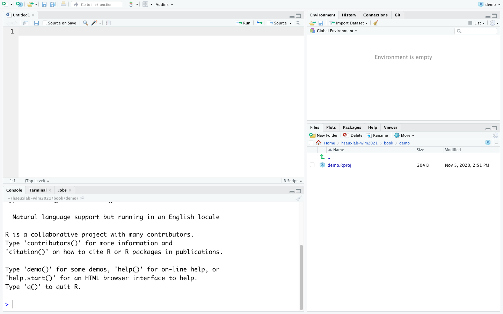
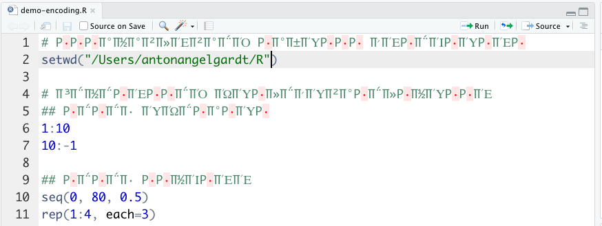

# Основы R



```{r opts, echo=FALSE, eval=TRUE}
knitr::opts_chunk$set(echo = TRUE, eval = TRUE, warning = FALSE, message = FALSE, error = FALSE)
```

```{r pkgs, echo=FALSE}
library(tidyverse)
theme_set(theme_bw())
library(rvest)
```


## Знакомство с R и RStudio {#r-greetings}

> — Я вот не могу выбрать: делать на R или на Python?
> — Да какая разница! Главное --- делай!

### Что это и откуда? {#where-r-from}

[R](https://www.r-project.org/) --- популярный язык программирования среди исследователей в социальных и гуманитарных науках. Если совсем коротко, то начиналось всё с языка [S](https://en.wikipedia.org/wiki/S_(programming_language)), который был языком программирования для статистического анализа. Потом его [доработали](https://www.researchgate.net/publication/240040602_Evaluating_the_Design_of_the_R_Language) и получился R.

Хотя сегодня всё ещё можно услышать, что «R --- это язык программирования для статистической обработки данных», это [ложь](https://en.wikipedia.org/wiki/False_(logic)). Да, когда-то [давно](https://en.wikipedia.org/wiki/Devonian) дела обстояли именно так, но сейчас R --- это полноценный язык программирования, который позволяет решать широкий спектр задач от статистического анализа и data wrangling до машинного обучения, моделирования и создания сайтов и приложений.


### Почему R? {#why-r}

- свободное ПО (часть [GNU Project](https://en.wikipedia.org/wiki/GNU_Project))
- динамично развивается
- громадные возможности расширения функционала
    - более 10 000 пакетов
    - открытый исходный код
    - возможность написать свои пакеты

```{r, echo=FALSE, cache=TRUE}
#| label: fig-n-pkgs
#| fig-cap: "Количество пакетов, доступное на CRAN. Столбцы отображаются пакеты, опубликованные в конкретном году, линия --- суммарное количество пакетов, опубликованное к данному году. Визуализация автора по [данным CRAN](https://cran.r-project.org/web/packages/available_packages_by_date.html)"

read_html("https://cran.r-project.org/web/packages/available_packages_by_date.html") %>%
  html_table() %>% .[[1]] %>% 
  mutate(year = str_extract(Date, "^\\d{4}")) %>% 
  summarise(n = n(),
            .by = year) %>% 
  arrange(year) %>% 
  mutate(cum_n = cumsum(n)) %>% 
  filter(year != "2008") %>% 
  ggplot(aes(x = year)) +
  geom_col(aes(y = n), fill = "royalblue") +
  geom_line(aes(y = cum_n), group = 1) +
  geom_point(aes(y = cum_n), size = 2) +
  labs(x = 'Год',
       y = "Количество")
```

- большое сообщество по всему миру, много ресурсов для задавания вопросов
- [Linear Warriors vs Quadratic Wizards](https://1d4chan.org/wiki/Linear_Warriors,_Quadratic_Wizards)
    - в SPSS, Jamovi? JASP (и другие GUI пакеты) ниже порог вхождения, но развитие навыков --- линейное
    - в R порог вхождения выше, но впоследствии случается резкий буст, и вы становитесь богами дата саенс

](../img/rpy-basics/linear-warriors-quad-wizards.png){#fig-linwar-quadwiz}

- [репродуцируемость](https://en.wikipedia.org/wiki/Reproducibility_Project) результатов


### R vs Python {#r-vs-py}

> – R лучше Python?
> – Нет. Но он и не хуже.

](../img/rpy-basics/r-vs-py.jpeg){#fig-r-vs-py}

Вообще файт R vs Python, на мой взгляд, несколько бессмысленный, поскольку, по факту, всё упирается в синтаксис языка. Ну, и запрос работодателя, конечно. Возможности обоих языков и скорость работы сопоставимы. Области применения по большей части тоже. Поэтому я пользуюсь следующей эвристикой:

- аналитика, статистика, графики, покрутить данные — R
- машинное обучение, нейросети, другой ИИ, интерфейсы и [собственно] программирование — Python

Многие, наверняка, оспорят такое разделение --- я же не стану отстаивать его истинность.

Мы будем работать на R, поскольку он всё же более популярен в наших кругах — среди «социально-гуманитарных аналитиков».


## Установка R и RStudio {#r-setup}

Чтобы нам радостно и приятно жилось, нужно установить:

- Сначала R
    - на [Windows](https://cran.r-project.org/bin/windows/base/)
    - на [Mac](https://cran.r-project.org/bin/macosx/)
    - на [Linux](https://cran.rstudio.com/bin/linux/)
- Затем [RStudio](https://docs.posit.co/ide/user/#rstudio-ide-oss-downloads)

Если что-то не установилось или вы предпочитаете облачные сервисы, то можно работать через браузер в [Posit Cloud](https://posit.cloud/).

:::{.callout-note}
Относительно недавно появился [Positron](https://positron.posit.co/download.html) --- ещё одна IDEшка для R. Если у вас есть опыт работы в VS Code, Positron может вам понравится больше.
:::


## Где спросить вопрос или искать ответ? {#r-docs}

- [Google](https://google.com/) --- препарат выбора
- [Stack Overflow](https://stackoverflow.com/) --- ответы на вопросы, и не только по R
- [Stack Overflow на русском](https://ru.stackoverflow.com/) --- то же самое, только отечественные специалисты
- [Cookbook for R](http://www.cookbook-r.com/) --- хорошая книжка для старта
- [Posit Community](https://community.rstudio.com/) --- ответы на вопросы по R
- [R-bloggers](https://www.r-bloggers.com/) --- про новинки в R и рядом с ним
- [Хабр про R](https://habr.com/ru/hub/r/)
- …

## Интерфейс RStudio {#rstudio-interface}

Итак, посмотрим на RStudio. При запуске у вас откроется что-то такое (@fig-rstudio-interface). Видно четыре (или три[^rstudio-layout]) окна. Давайте последовательно разбираться, что в каждом из них происходит.

[^rstudio-layout]: При первом запуске может не быть окна Code Editor. Чтобы его открыть, сделайте `File → New File → R Script` или нажмите `Ctrl + Shift + N` (`⌘ + Shift + N`).

{#fig-rstudio-interface}

### Console {#rstudio-console}

В консоль можно писать команды и запускать их нажатием `Enter`. Они будут сразу выполняться. После некоторых команд будет выводиться какой-то результат. С помощью стрелок ↑ и ↓ можно вывести предыдущие команды, например, чтобы запустить их ещё раз, не вводя повторно, или каким-либо образом их изменить.

Можно, в прицнипе, работать только из консоли, но на практике это не очень удобно. Главным образом, из-за того, что команды улетают «вникуда» и к некоторым уже будет нельзя вернуться. Поэтому существует редактор кода.

### Code Editor {#rstudio-code-editor}

По своей сути это обычный блокнот с той лишь разницей, что здесь некоторые слова раскрашены. И в этом блокноте мы пишем текст программы (скрипт), который состоит из комманд. Чтобы выполнить команду, нам необхожимо отправить её в консоль с помощью `Ctrl + Enter` (`⌘ + Enter`). Нажатие `Enter` здесь как и в обычном текстовом редакторе осуществляет переход на новую строку. Результат выполнения команды отображается в консоли, как будто вы изначально запускали команду там.

В консоли удобно что-то быстро посчитать, скрипт же удобнее при работе с длинными командами и для сохранения кода (текста) для дальнейшей работы. Чтобы сохранить скрипт, сделайте `File → Save (as…)` или нажмите `Ctrl + S` (`⌘ + S`).

Несмотря на то, что файл сохраняется с расширением `.R`, это всё ещё обычный текст, который можно открыть и редактировать в любом текстовом редакторе (типа *Notebook* или *TextEdit*).

#### Кодировка {#rstudio-encoding}

Компьютер умеет хранить в памяти только цифры. А текст мы набираем буквами. Поэтому ему приходится перекодировать буквы в цифры. Делать это можно по-разному — поэтому существуют разные кодировки.

При сохранении скрипта важно следить за кодировкой, особенно если в тексте встречаются кириллические знаки. В разных операционных систем разная кодировка по умолчанию, поэтому на другом компьютере файл может открываться с неведомой кракозяброй типа @fig-encoding.

Обычно при сохранении файла с кириллицей программа автоматически спрашивает, в какой кодировке его надо сохранить. Выбирайте `UTF-8` --- она корректно откроется в любой операционной системе. Также вы можете сохранить файл в определенной кодировке в помощью `File → Save with Encoding…`.

Если при открытии файла у вас отображается кракозябра, подобная той, которая показана выше, нужно узнать кодировку файла (для Win это обычно `ASCII`, для Mac --- `UTF-8`) и выполнить `File → Reopen with Encoding…`.

{#fig-encoding}


### Environment (Workspace) и History {#rstudio-environment}

Здесь, в Environment, можно наблюдать переменные и другие объекты, которые создаются в процессе работы кода, а также некоторую информацию о них. Это удобно, поскольку код, бывает, разрастается до сумасшедшего количества строк, и что вы там насоздавали тремястами строками выше — уже и не упомнить. А тут всё под рукой.

В окне History можно найти историю команд, которые вы выполняли. Может быть полезно, чтобы не листать консоль, которая, как правило, завалена результатами и ошибками.


### Plots, Files, Packages, Help, Viewer {#rstudio-other}

Очень полезное окно в кучей всего.

- сюда выводятся графики, которые вы строите
- здесь можно найти справку по функциям и пакетам
- проверить, какие у вас установлены пакеты и их версии
- посмотреть файлы в рабочей директории
- наблюдать 3D-визуализации, превью отчетов, презентаций и много чего ещё


## R как калькулятор {#r-calculator}

R --- полноценный язык программирования с множеством возможностей, но давайте начнём с малого. Первое, от чего стоит избавиться --- это страх консоли. Боязни калькулятора вроде не бывает (но это не точно[^afraid-calculatior]), поэтому стартанём с этого.

[^afraid-calculatior]: Бывает, что [вот это](https://psychtimes.com/logizomechanophobia-fear-of-computers/) распространяют и на калькуляторы тоже. [Кек]

### Арифметические операции {#r-arithm}

В R есть все привычные нам математические операции и операторы для них: `+`, `-,` `*,` `/,` `^`. Выполняются они тоже вполне предсказуемо.

```{r arithm}
2 + 5 # сложение
10 - 4 # вычитание
3 * 7 # умножение
30 / 3 # деление
2 ^ 10 # возведение в степень
```

Также есть два особых деления.

```{r division}
5 %/% 2 # целочисленное деление
5 %% 2 # взятие остатка от деления (5 mod 2)
```

Попробуйте посчитать что-нибудь сами.

](../img/rpy-basics/orelly-changing-staff.jpeg)

В R есть скобки — `( )`. Их назначение такое же, как и в математике. Порядок выполнения арифметических действий (приоритет операторов, operator precedence) тоже как в математике. Итого имеем:

```{r operator-precedence}
4 * 4 + 4
4 * (4 + 4)
5 * 5 ^ 5
(5 * 5) ^ 5
```

Так что используйте скобки, если вы не уверены, в каком порядке будут выполняться действия. Или смотрите таблицу приоритета операторов по команде `?Syntax`.


### Функции {#r-funs}

Но что, если нам надо посчитать что-то более сложное? Например, извлечь корень или вычислить логарифм?

Для вычисления подобных штук существуют функции. К вопросу, что есть функция, мы ещё не раз вернемся, а пока ограничимся самым общим пониманием: функция это некоторая команда, которая имеет вид `название_функции()`, просит что-то указать у себя в скобках (например, число) и после выполнения возвращает нам некоторый ответ (например, снова число).


На примере с квадратным корнем это выглядит так:

```{r math-sqrt}
sqrt(4)
```

:::{.callout-important appearance="simple"}
R чувствителен к регистру (case-sensitive), то есть SQRT(4) не сработает.
:::

А вот логарифм:

```{r math-log}
log(16)
```

Вот только здесь есть одна важная деталь. Если мы вспомним определение логарифма, то окажется, что

$$
\log_a b = c \equi a^c = b 
$$

> Логарифм некоторого числа — это показатель степени, в которую нужно возвести основание, чтобы получить данное число.

Здесь придется чуть углубиться в **аргументы функции**. Аргументы --- это то самое «что-то», что мы записываем в скобках. Бывают *обязательные аргументы*, без которых функция просто не будет работать и выдаст ошибку, например,

```{r, eval=FALSE}
log() # попробуйте выполнить эту команду
```

и *необязательные аргументы*, у которых уже задано некоторое значение по умолчанию, например, аргумент `base` у функции `log()`, который отвечает как раз за задание основания логарифма.

Список аргументов функции можно посмотреть в справке по данной функции, открыв окно `Help` и введя в поиск название функции, или выполнив одну из следующих команд:

```{r call-help, eval=FALSE}
help(log) # ищет справку по функции
?log # синоним предыдущей команды
```

Также в справке можно найти много другой полезной информации.

Согласно хелпу, значение по умолчанию равно $\mathrm{e}$, то есть вычисляется натуральный логарифм, если основание не указано. Но подождите, в хелпе не написано никакого $\mathrm{e}$, там есть что-то странное в виде `exp(1)`. Да, тут спорить бессмысленно, однако `exp(1)` --- это не что иное, как экспонента от единицы, то есть $\mathrm{e}^1 = \mathrm{e}$, что равно:

```{r math-exp}
exp(1)
```

Итак, мы выучили две важные вещи: (1) функцию `exp()` и то, что (2) в качестве аргументов функции можно передавать результаты другой функции. Посмотрите примеры:

```{r math-log-examples}
log(x = 16, base = 2) # эксплицитно задаём основание и число
log(x = 16, b = 2) # имена аргументов можно не дописывать, если они не совпадают с другими
log(base = 2, x = 16) # при таком способе задания порядок аргументов можно менять
log(625, 25) # имя аргумента можно не писать, но тогда соблюдать порядок следования
log(16, base = exp(sqrt(2))) # задаём аргумент через результат функций
log10(1000) # десятичный логарифм
log2(512) # двоичный логарифм
```

На логарифмах, естественно, свет клином не сошёлся, есть и множество других функций, например, тригонометрические (`sin()`, `cos()`, …). Да и сами арифметические операции, на самом деле, это тоже функции:

```{r arithm-ops-funs}
`+`(7, 3)
```

К функциям, как я говорил, мы ещё вернемся, а пока двинемся дальше.

Но перед этим ещё одна важная деталь. Вы, наверняка, заметили, что после команд я часто пишу `#` и далее текст. Это комментарии. Они крайне важны в коде, поэтому я, и не только я, настоятельно советую вам их оставлять — и чем больше, тем лучше. Сейчас это может казаться бессмысленным, но поверьте, когда ваш код будет занимать 50+ строк — а это очень небольшой код — разобраться уже будет непросто, не говоря о том, что делать, если вы открыли его через месяц или, не дай боже, год…

](../img/rpy-basics/comments.jpeg)

Закомментить несколько строк сразу можно сочетанием `Ctrl + Shift + C` (`⌘ + Shift + C`).


### Сравнение и логические операции {#r-logic}

Как мы знаем, числа можно сравнивать. Также мы знаем, что существуют операторы сравнения --- все они есть и в R: `>`, `<`, `>=`, `<=`, `==`, `!=` --- больше, меньше, больше или равно, меньше или равно, равно (ли), не равно.

:::{.callout-warning}
Обратите внимание, что сравнение на равенство осуществляется с помощью оператора `==`. Одинарное «равно» (`=`) имеет другой смысл (см. ниже).
:::

Посмотрим на ряд простых примеров:

```{r}
2 > 4
2 < 6
3 == 5 - 2
7 >= 7
4 != 8 ^ 2
```

Вроде все логично и понятно. Единственное, что стоит помнить, это то, что приоритет операторов сравнения *ниже*, чем у арифметических операций.

Само по себе сравнение интуитивно понятно, однако нам интересен здесь получаемый результат. Ранее мы имели дело с числами — здесь что-то другое. С одно стороны, программы выдает на слово, но это не простое слово. Это особый тип данных — логическое значение («истина» TRUE или «ложь» FALSE). Типы данных мы обсудим далее, пока же снова ограничимся простым и интуитивным пониманием.

Мы можем составлять из простых сравнений сложные высказывания с помощью логических операторов. Самые известные и часто используемые из них — «И» (&) и «ИЛИ» (|). Подробно об их смысле здесь. Если в двух словах, то «И» истинно, когда оба соединяемых им утверждений истинны, а «ИЛИ» истинно, когда хотя бы одно из соединяемых им утвердений истинно. Например,

```{r}
2 > 6 & 8 < 12
1 != 4 & 5 == 10 / 2
6 + 2 < 10 | 8 == 10 # что по сути эквивалентно 8 <= 10
1 + 1 == 2 | FALSE & 4 != 2 * 2
(1 + 1 == 2 | FALSE) & 4 != 2 * 2
```

:::{.callout-warning appearance="simple"}
Как видно из примеров, приоритет логических операторов ниже приоритета операторов сравнения, а приоритет у `&` выше, чем у `|`.
:::


## Assignment и переменные {#r-assignment}

Мы что-то считаем в R и нам важно не терять результаты вычислений. Для этого существуют переменные, в которые можно записывать промежуточные результаты. Делается это так:

```{r}
x <- 3
```

В данном случае мы записали в переменную `x` значение $3$. Разберёмся подробно:

1. Обозначаем название переменной, в данном случае `x`.

2. Говорим, что надо записать в переменную значение или же присвоить какой-то результат функции. Делается это с помощью оператора присваивания (assignment) `<-`, который вводится с клавиатуры шорткатом `Alt` + `-` (`Option` + `-`). Этот оператор записывает то, что стоит от него справа, в то, что написно от него слева.
3. Пишем то, что нужно присвоить в переменную. Это может быть конкретное значение, но чаще это результат какой-либо функции, например:

```{r}
y <- sin(90)
```

:::{.callout-note appearance="simple"}
На самом деле, название может быть любое, однако рекомендуется давать им осмысленные имена, чтобы потом не запутаться. Длинные названия --- это, скорее, хорошо. Это немного съедает времени сейчас, но значительно экономит его в будущем!
:::

:::{.callout-warning appearance="simple"}
Также НЕ рекомендуется использовать для обозначения переменных названия функций (например, `data()`, `str()` и др).
:::

После создания переменной, она появляется в Environment. Далее переменные можно использовать в вычислениях:

```{r}
x + y
x^y * x^2
log(y, x)
x == y
```

Обратите внимание ещё раз, что сравнивания переменные мы используем оператор `==`. А что будет если использовать одно «равно»?

```{r}
x = y
x
```

Выполнилась операция присваивания. Да, её можно записывать и через «равно», но это не очень принято. Традиционно `<-` используют для присваивания, а `=` для задания аргументов функций. У оператора присваивания самый низкий приоритет из всех, то есть присваивание выполняется после всех вычислений. Хм, как неожиданно и логично.


## Типы данных {#r-datatypes}

Итак, до какого-то момента мы работали только с числами, а затем начали их сравнивать, и получили что-то новое типа `TRUE` и `FALSE`. И как мы отметили, это новый тип данных.

А что такое вообще тип данных? Тип данных --- это характеристика данных, которая определяет:

- *множество допустимых значений*, которые могут принимать данные этого типа,
- и *набор операций*, которые можно осуществлять с данными этого типа.

Что это значит, будем разбираться на конкретных примерах.

## `numeric` {#r-datatypes-numeric}

Этот тип данных нам уже знаком --- это числа. Например, если мы создадим переменную со значением `7` и захотим узнать её тип, то это будет выглядеть так:

```{r}
a <- 7
class(a) # эта команда выводит тип данных
```

Итак, действительно, $7$ --- это число, нас не обманули.

:::{.callout-note appearance="simple"}
Вообще-то, в R много типов числовых данных: `integer` (целые числа), `double` (числа с десятичной дробной частью), `complex` (комплексные числа). Последние вам вряд ли встретятся в ближайшее время, а по поводу деления первых можно особо не заморачиваться --- R сам разберется, что к чему, и переконвертирует как надо.

Обилие числовых титипов обусловлено тем, как хранятся числа на железе. А о [комплексных числах](https://en.wikipedia.org/wiki/Complex_number) в R немного можно почитать [тут](http://www.r-tutor.com/r-introduction/basic-data-types/complex).
:::

Если мы всё же хотим выяснить, что это за числовые данные, то воспользуется функцией `typeof()`:

```{r}
typeof(a)
```

На числовых данных выполняются все математические операции и различные функции, с чем мы развлекались на протяжении предыдущей главы. А множество значений этого типа, как вы понимаете, бесконечно[^num-value-range].

[^num-value-range]: Строго говоря, конечно, не бесконечно, ибо память компьютера ограничена. Но с практической точки зрения в рамках наших задач в общем-то можно считать, что бесконечно.


## `logical` {#r-datatypes-logical}

Здесь все гораздо проще. Есть всего два значение TRUE и FALSE, то есть «истина» и «ложь». Получаются логические данные в результате сравнения — и мы это уже тоже видели в предыдущей главе — и на себе сравнение они также допускают.

```{r}
TRUE == TRUE # но вообще-то это операция, которая не несет никакого смысла
FALSE != FALSE # эта тоже не несет
FALSE == TRUE # и эта
```

`TRUE` и `FALSE` — это логические константы, и, обратите внимание, записываются они прописными буквами. `true` и `True` не сработают. Правда есть вариант записывать их только одной буквой `T` и `F`, но c’est mauvais ton, и вот почему:

```{r}
T == TRUE
T <- FALSE
T == TRUE
```

Константы `TRUE` и `FALSE` защищены от перезаписи (на то они и константы).

Поэтому мы не будем жалеть времени и символы и в угоду удобочитаемости и стабильности кода будем писать логические константы полностью.

Кроме сравнения, логический тип данных допускается на себе логические операции, что в общем-то логично.

Основных операций две:

- логическое И (конъюнкция, `&`, $\wedge$, $\cdot \,$)
- логическое ИЛИ (дизъюнкция, `|`, $\vee$, $+ \,$)

Работают они следующим образом в соответствии с таблицей истинности:

```{r}
TRUE & TRUE
TRUE & FALSE
FALSE & TRUE
FALSE & FALSE
TRUE | TRUE
TRUE | FALSE
FALSE | TRUE
FALSE | FALSE
```

Можем создать и более сложные конструкции. Например, с участие переменных:

```{r}
x <- 2
y <- 6
n <- 7

x > 2 & y < 10
x != 100 | n != 7
!(x != 100 | n != 7)
```

:::{.callout-tip appearance="simple"}
Заметьте, что `!` существует не только в составе `!=`, но и как самостоятельный логический оператор и обозначает *логическое отрицание*.
:::

:::{.callout-note appearance="simple" collapse="true" title="XOR"}
Также есть оператор `xor()` (который выглядит как функция[^operator-as-func]), обозначающий *исключающее ИЛИ*. Это логическая функция от двух переменных и работает вот так:

```{r}
xor(TRUE, TRUE)
xor(TRUE, FALSE)
xor(FALSE, TRUE)
xor(FALSE, FALSE)
```

Он используется редко, но может когда-нибудь внезапно пригодиться.
:::

[^operator-as-func]:Так-то любой оператор (арифметический или логический) — это функция от двух переменных. В предудщей главе был пример ``` `+`(7, 3) ```, а теперь попробуйте выполнить ``` `&`(TRUE, FALSE) ```.


## `character` {#r-datatypes-character}

Очевидно, что в практике мы не всегда имеет дело только с цифрами, мы храним ещё и текстовую информацию. Для этого есть тип данных `character` (хотя другие языки программирования с R бы [поспорили](https://pediaa.com/wp-content/uploads/2019/04/Difference-Between-Character-and-String-Comparison-Summary.jpg)).

```{r}
x <- "Доброе утро, коллеги!"
class(x)
```

`character` — это строки (*strings*) символов, поэтому они должны быть закавычены одинарными (`'`) или двойными (`"`) кавычками. Так R поймёт, где строка начинается и где заканчивается. Большой разницы между одинарными и двойными кавычками нет, но если у вас кавычки внутри кавычек, здесь надо быть аккуратным:

```{r}
x <- 'Мужчина громко зашёл в комнату и высказал решительное "здравствуйте"'
x
```

> А вообще, есть беспроигрышный [и типографически верный] вариант:

```{r}
x <- 'Мужчина громко зашёл в комнату и высказал решительное «здравствуйте»'
x
```

> Строковый тип данных мы еще подробно обсудим в теме работы со строками, а пока посмотрим вот на что…

## `factor` {#r-datatypes-factor}

Чтобы разговор и типах данных был полным, необходимо сказать о таком типе данных как `factor`. Хотя он не является «базовым» типом, всё же ему необходимо уделить некоторое внимание.

**Фактор** — это строковые данные, которые хранятся как числа. Почему там делать удобно? Потому что фактор содержит определённый (как правило, небольшой) набор уникальных значений (чаще всего около 2–5).

Для чего используются факторы? Для задания каких-либо групп в данных. Например, у вас есть экспериментальные данные, в которых есть два экспериментальных условия и одно контрольное. Тогда вектор, задающий эти условия может выглядеть примерно так:

```{r}
conditions <- c('exp1', 'exp2', 'control', 'exp1', 'exp1', 'exp2', 'control', 'exp2', 'control')
conditions
```

Сейчас это строковый вектор — это достаточно просто превратить в фактор:

```{r}
as.factor(conditions)
```

В аутпуте добавилась строчка `Levels`, которая как раз и определяет набор уникальных значений. По умолчанию уровни фактора выстраиваются в алфавитном (лексикографическом) порядке. Если вам принципиален порядок факторов — например, в случае эксперимента на зрительный поиск у вас есть несколько visual set size (количество стимулов в пробе) — тогда можно воспользоваться специальной функцией и создать *упорядоченный фактор*:

```{r}
vis_set_size <- factor(rep(c(3, 6, 9), times = 10),
                       levels = c(3, 6, 9), # задаём порядок уровней
                       ordered = TRUE) # указываем, что нам нужн упорядоченный вектор
vis_set_size
```

Теперь в строке `Levels` указаны не только сами уровни, но и отношение порядка для множестве значений. Как видите, в фактор можно превратить не только текстовый вектор, но и числовой.

> В актуальных версиях R обычно текстовые векторы автоматически приводятся к факторам в тех случаях, когда это нужно. Однако если нам нужен числовой вектор как факторный, это придется делать вручную. Хотя, конечно, числовые данные мы чаще всего рассмтариваем именно как числовые.


## Coercion [part one] {#r-datatypes-coercion}

А что будет, если мы пренебрежём допустимыми операциями и попробуем, например, сложить не-числа? Допустим, так:

```{r}
TRUE + TRUE # складываем две истины
```

Внезапно, команда выполнилась. Можно задаться вопросом, почему именно так, ведь правила алгебры логики говорят, что должно быть по-другому. Опуская детали, скажем, что оператор `+` несет только арифметический, но не логический смысл, поэтому произошло следующее:

- оператор `+` умеет работать только с числовыми значениями
- но получил логические
- поэтому попробовал привести их к числовым
- у него получилось — `TRUE` легко и непринуждено приводится к `1`, а `FALSE` к `0`
- далее выполнилось сложение

Такое поведение называется **приведение типов (coercion)**. Подробно мы его будем обсуждать позже, когда изучим структуры данных и поймем, какие опасности это может за собой влечь. Сейчас же ознакомимся с некоторыми примерами.

Приведение типов сработает не всегда. Например, если мы попытаемся сложить строки[^js-string-sum], то получим ошибку:

```{r}
#| error: true
"abc" + "cbd"
```

[^js-string-sum]: Хотя, например, для JavaScript [сложение строк](https://learn.javascript.ru/operators#slozhenie-strok-pri-pomoschi-binarnogo) — стандартная процедура.

Чтобы контролировать приведение типов, есть семейство функций `as.*()`. Посмотрим, как они работают.

```{r}
# приводим логические данные в числовым
as.numeric(TRUE)
as.numeric(FALSE)
# приводим числовые данные к логическим
as.logical(1)
as.logical(0)
as.logical(-1) ## наблюдаем, что все не так однозначно
as.logical(0.4)
as.logical(sqrt(2))
# числовые данные к строке
as.character(23)
as.character(-150)
# логические данные к строке
as.character(TRUE)
as.character(FALSE)
```

> Поздравляю! Мы закончили с основами основ! Пора переходить к самому важному и интересному — структурам данных, а именно – векторам!


## Структуры данных {#r-datastructures}

## Векторы {#vectors}

Простейший способ организации данных — это вектор. Казалось бы, мы знаем, что вектор — это направленный отрезок. Безусловно, это так — в рамках Евклидовой геометрии, которую мы в давнем прошлом учили. Однако это не единственный способ смотреть на вещи. С точки зрения структур данных, **вектор — это одномерный массив**, а если по-русски, то **набор элементов одного типа (например, чисел)**.

Эти два представления, на самом деле, не противоречат друг другу. Геометрически, как мы сказали, вектор — это направленный отрезок. Он задаётся через координаты начала и конца. Если мы условимся всегда начинать вектор из начала координат — то есть будет считать равными все векторы, которые имеют одинаковую длину и одинаковое направление[^free-vec] — то мы сможем задавать вектор только через координаты его конца. В случае двумерного пространства вектор будет однозначно задаваться парой чисел $(x, y)$, в случае трёхмерного — тройкой чисел $(x,y,z)$, а в случае $n$-мерного пространства — набором чисел $(x_1, x_2, x_3, \dots, x_n)$.

[^free-vec]: Такие векторы называются *свободными*.

Чтобы создать вектор в R надо воспользоваться функцией `c()`. Она принимает неограниченное количесво аргументов, которые объединяет в вектор. В вектор можно объединить элементы *только одного типа*.

```{r}
v <- c(1,2,3,5,6,7)
```

Сохраним получившийся числовой вектор в переменную `v`. Присваивание векторов ничем не отличается от присваивания чисел, во-первых, потому что *в R нет скаляров*, и все числа — это векторы типа `numeric` длиной 1, а во-вторых, потому что и число, и вектор, и другие структуры данных (и даже функции!) — всё это *объекты*. А assignment — не что иное, как присваивание имени некоторому объекту, и нет разницы, что мы называем — число, матрицу, список, датафрейм или функцию.

### Coercion [part two] {#coercion2}

Взбунтуемся, и объеденим в один вектор разные типы данных:

```{r}
v0 <- c(1, 2, TRUE, FALSE)
v0
```

Бунт не удался — вектор всё равно был создан. Но что произошло?

С приведением типов мы уже сталкивались, когда пытались складывать логические константы. Аналогично R действовал и здесь:

- есть задача создать вектор
- но на выход функции поступили данные различных типов
- придётся сделать так, чтобы тип был всё-таки один
- `numeric` к `logical` однозначно привести сложно (что есть `2` — `TRUE` или `FALSE`?)
- `logical` к `numeric` приводится очень хорошо и красиво (`TRUE` — `1`, `FALSE` — `0`)
- после приведения типов можно выполнить команду создания вектора.

Сделаем вектор из полного салата — добавим сторовые значения:

```{r}
v0 <- c(1, 2, TRUE, FALSE, 'text', 'string')
v0
```

Наблюдаем, что все свелось к типу `character`, что вполне ожидаемо, так как `2` в `"2"` превращается однозначно, а вот в какое число (или логическую константу) превратить `"string"`, не очень понятно.

Собственно, можно вывести иерархию приведения типов:

**logical < integer < numeric < complex < character**

### Генерация числовых последовательностей {#seq_gen}

Создавать руками векторы — это, конечно, радостно и приятно, но не очень юзабельно. На практике часто возникает потребность сгенерировать определенную числовую последовательность. Например, у вас есть опросниковые данные, из которых необходимо удалить персональные данные, но при этом сохранить возможность соотнести персональные данные и результаты анализа по каждому респонденту — вам нужно сгенерировать переменную ID. Вам поможет оператор `:`, который генерирует последовательность в заданных пределах с шагом 1:

```{r}
1:10
15:0
```

Если вам нужна последовательно с другим шагом, например, 0.5, то подойдет функция `seq()`:

```{r}
seq(from = 1, to = 10, by = 0.5) # задаём шаг последовательности
seq(0, -6, -1.5) # или без указания названий аргументов
seq(from = 5, to = 30, length.out = 20) # задаём длину последовательности
```

Допустим, у вас есть данные (пусть выборка будет 15 человек), в которых каждые две строки относятся к одному респонденту, но к двум различным экспериментальным условиям (экспериментальному и контрольному). Тогда можно сделать такие переменные:

```{r}
rep(1:15, each = 2) # для id
rep(c('exp', 'control'), times = 15) # для обозначения условия
```

Также можно сгенерировать случайную последовательность чисел (например, для того, чтобы использовать её при сабсете случайной подвыборки данных):

```{r}
sample(x = 1:30, size = 15)
```

Чтобы результат генерации при повторном запуске кода получался одним и тем же, перед выполнением команды `sample(...)` нужно выполнить команду `set.seed(...)`:

```{r}
set.seed(69)
```

Число внутри функции может быть абсолютно любым.

### Операции с векторами {#vec_operations}

Операции, которые можно выполнять над векторами зависят от типа данных, которые содержатся в векторе. Чаще всего мы будем работать с числовыми векторами, поэтому разберем подробно именно их.

Пусть у нас будет два вектора:

```{r}
set.seed(42) # задаём положение для датчика случайных чисел
v1 <- sample(1:100, 20)
v2 <- sample(-50:100, 20)
```

Над векторами можно выполнять арифметические операции:

```{r}
v1 + v2
v1 - v2
v1 * v2
v1 / v2
```

Они выполняются поэлементно, то есть соответсвующие элементы двух векторов складываются (вычитаются, умножаются, делятся), и в результате получается новый вектор.

Кроме того, векторы можно поэлементно сравнивать:

```{r}
v1 < v2
v1 == v2
v2 <= v1
```

Также к вектору можно применять и функции:

```{r}
sin(v1)
log(v1)
exp(v2)
```

Можно применять несколько функций подряд:

```{r}
log(abs(v2))
```

Большинство арифметических функций выполняется поэлементно, однако существуют такие, которые поэлементно не могут быть выполнены, например сумма по вектору:

```{r}
sum(v1)
```

Или функция, которая вычисляет длину вектора (в смысле количества элементов в нём):

```{r}
length(v2)
```

### Recycling {#recycling}

Доныне мы складывали векторы одинаковой длины. С ними всё ясно — они складываются поэлементно. А что будет, если мы сложим векторы разной длины?

```{r}
v3 <- rep(1, times = 10); v3 # создаём векторы
v4 <- sample(1:100, 2); v4
v5 <- sample(1:100, 3); v5
length(v3) # проверяем длину
length(v4)
length(v5)
```

Итак, сумма:

```{r}
v3 + v4
v3 + v5
```

Внимательно посмотрим на результат. В первом случае мы складывали вектор из десяти элементов и вектор из двух элементов. Чтобы выполнирь эту операцию R выполняет *зацикливание (recycling)* более короткого из двух, чтобы каждый элемент большего по длине вектора получил в соответствии элементн меньшего. Так как десять кратно двум, то по сути было выполнена следующая команда:

```{r}
v3 + rep(v4,
         times = length(v3) / length(v4))
```

Во втором случае длина меньшего вектора не кратна длине большего, поэтому recycling происходит до тех пор, пока не будут покрыты все элемент большего вектора. Вектор из трех элементов укладывается на вектор из десяти элементов три раза — поэтому мы видим в результате три раза последовательность `59, 11, 41` — и остается ещё один десятый элемент, который суммируется в первым элементом меньшего вектора — поэтому последний элемент в векторе результата `59`.

### Индексация векторов {#vec_indexing}

В практике мы постоянно сталкиваемся в необходимость анализировать не все данные в векторе, а их часть. Поэтому встаёт вопрос о том, как эту часть извлечь?

Извлечение части данных из вектора называется **индексацией**. Это делается так:

```{r}
v1[1:10] # первые десять элементов вектора
v1[c(1,3,5,7)] # 1-й, 3-й, 5-й и 7-й элементы вектора
v1[sample(1:20, 5)] # случайная подвыборка пяти элементов
```

Логика проста — чтобы взять часть вектора, нам нужен вектор индексов тех элементов, которые мы хотим вытащить. Его мы поместим в квадратные скобки — и будет нам счастье. Вектор индектов можно получить любыми способами:

- сгенерировать последовательноть (как в первом варианте),
- задать индексы вручную, не забыв при этом обернуть их в фнукцию `c()`, чтобы указать, что это вектор, (как во втором варианте),
- воспользоваться функцией, которая возвращает вектор.

Полезно также является индексация через отрицательные индексы:

```{r}
v2
v2[-1] # все элементы, кроме первого
v2[-(1:5)] # все элементы, кроме первых пяти
```

Особого внимания заслуживает **индексация логическими векторами**. Например, мы хотим отобрать все элементы вектора, которые больше некоторого числа. Как это сделать?

Нам нужен вектор, которым мы будем индексировать исходный вектор. Как его получить? Известно, что при сравнении векторов между собой получается логический вектор. Но ведь число — это тоже вектор, просто единичной длины? Значит, если мы будем сравнивать вектор с числом, произойдёт recycling, в результате которого каждый элемент вектора будет сравнен с этим числом. То есть:

```{r}
v1 > 40
```

Отлично! Вектор есть. Можно ли им проидексировать наш исходный вектор `v1`? Можно! Аналогично тому, как мы это уже делали.

```{r}
v1[v1 > 40]
```

Конструкция, возможно, выглядит немного странновато — но работает!

### NA, NaN, NULL {#na}

Взбунтуемся ещё раз и посмотрим, что получится, если мы будем вытаскивать из вектора элементы, используя индексы, которые выходят за границы длины вектора. Например, у нас есть вектор `v2`, длина которого

```{r}
length(v2)
```

Попробуем сделать так:

```{r}
v2[15:25]
```

Мы получили нечто, с чем ранее не сталкивались. `NA` (от *not available*) обозначает значение, которое недоступно. Как правило, в реальных данных они появляются при каких-либо ошибках записи данных. Впрочем, не всегда. Можно придумать и такой дизайн исследования, когда пропуски также будут информативны и могут анализировться. В нашем случае мы обратились к элементам, которых нет в нашем векторе, поэтому R ничего более не смог сделать, как вернуть нам свидетельство того, что такие элементы он из вектора достать не смог.

`NA` ведёт себя весьма специфично. Например, если мы попробуем посчитать сумму по получившемуся вектору, то результат будет следующим:

```{r}
sum(v2[15:25])
```

Аналогичная ситуация возникнет, если мы будем вычислять среднее:

```{r}
mean(v2[15:25])
```

Такое поведение функций может поначалу напрягать, однако оказывается очень полезным при работе с реальными данными.

И всё же функция `sum()` не так проста, и умеет бороться с `NA`. Для этого у неё есть аргумент `na.rm`, которому нужно задать значение `TRUE`, если мы хотим, чтобы сумма все же была посчитана:

```{r}
sum(v2[15:25], na.rm = TRUE)
```

Попробуем вычислить логарифм по вектору `v2`:

```{r}
log(v2)
```

Опять всё не слава богу. Теперь у нас `NaN`. Это почти как `NA`, но не совсем. `NaN` обозначает не-число (*not a number*). То есть, это не пропущенное значение, оно существует, но R его не может вычислить. Если мы сравним два вектора,

```{r}
v2; log(v2)
```

то обнаружим, что `NaN` появляется там, где мы пытаемся вычислить логарим отрицательного числа. А, как мы помним, функция логарифма определена только на положительно полуоси $x$. Вот и получается, что логарифм отрицательного аргумента — это какая-то неведомая сущность, то точно не-число.

В функциях `NaN` ведёт себя аналогично `NA`:

```{r}
sum(log(v2))
```

Мы поговорили о двух важный константах используемых в R. Есть ещё одна, и имя её `NULL`. Это имя обозначает «ничего», то есть, что объект пуст.

Например, возьмем вектор `v`, который мы создавали в самом начале, и положим в него `NULL`:

```{r}
v <- NULL
v
```

Теперь в этом векторе ничего не лежит.

`NULL` может использоваться при задании аргументов функций или как результат работы функций, если возвращается пустой объект.

## Матрицы {#matrix}

Говоря о векторах, мы обозначили, что вектор — это одномерный массив. А раз есть одномерные массивы, значит бывают какие-то ещё? Да. Сгенерируем некоторый вектор:

```{r}
v6 <- sample(1:100, 12); v6
```

и попробуем его «сложить» в «таблицу» так, чтобы в каждой строке было по три числа:

```{r}
m1 <- matrix(v6, ncol = 3); m1
```

Так как мы «складываем друг на друга» части одномерного массива, у нашего нового массива возникает новое измерение — если вектор был только одной строкой, то теперь в нашем массиве есть и строки, и столбцы. **Двумерный массив назвается матрицей**.

```{r}
class(m1)
```

И поэтому для его создания мы использовали функцию `matrix()`. В качестве основных аргументов она хочет видеть вектор, который мы будем «упаковывать» в матрицу, а также количество строк или столбцов новой матрицы.

### Индексация матриц {#matrix_indexing}

От того, что мы свернули вектор в матрицу, он не перестал быть вектором. [Шок!] То есть матрица по сути всё ещё тот же самый вектор, поэтому индексировать её можно точно так же, как и вектор:

```{r}
v6[1]; m1[1]
v6[4]; m1[4]
v6[11]; m1[11]
```

Однако поскольку матрица — это всё же матрица, она отличается от вектора тем, что у неё есть дополнительный атрибут `dim`, который отображает её размерность:

```{r}
dim(m1)
```

В данном случае наблюдаем, что размерность матрицы $4 × 3$, и это справедливо, ведь именно такую матрицу мы и создавали. А раз у нас имеется указание на количество строк и столбцов в матрице, то мы можем вытащить элемент(ы) как раз по его позиции:

```{r}
m1[1, 2] # вытаскиваем элемент из первой строки и второго столбца
```

Те же квадратные скобки, только указываем мы теперь две «координаты» — сначала строки, затем столбцы. Как не запутаться? Аналогия с координатами не случайна: строки — горизонтальны, первая координата на координата на координатной плоскости ($x$) тоже задаёт положение точки на горизонтальной оси; столбцы — вертикальны, вторая координата ($y$) задает положение точки на вертикальной оси.

Также мы можем вытащить не только отдельный элемент, но и какую-то часть матрицы. Всё работает аналогично векторам:

```{r}
m1[1:3, 2:3]
```

Если мы выползем за границы индексации, R начнёт ругаться:

```{r}
#| error: true
m1[1:3, 2:4]
```

Над матрицами можно проводить разные операции --- складывать, перемножать, возводить в степень --- так же, как и с векторами.


## Списки {#lists}

До текущего момента мы говорили о структурах данных, которые требуют одинакового типа данных в себе. Давайте теперь вообразим вектор без ограничения на однотипность данных. Это будет **список (list)**.

```{r}
l <- list(69, "text", TRUE)
l
```

Но список даёт нам ещё больше возможностей, потому что он может собирать в себя вообще любые объекты:

```{r}
l2 <- list(c("This", "list", "contains", "a", "matrix"), m1, l)
l2
```

Таким образом, список может являть собой крайне сложную структуру. Чтобы разобраться, как устроен конкретный список, можно воспользоваться функцией `str()`, которая отобразит структуру списка:

```{r}
str(l2)
```

Как видно в аутпуте функции, список содержит три элемента: текстовый вектор длиной 5, массив целых чисел, размером 4×3, и список, который в свою очерель состоит также из трёх элементов — числа 69, строкового вектора, содержащего одно значение ("text") и логического вектора длиной 1, который содержит значение «истина».

Можно назвать отдельные элементы списка собственными именами:

```{r}
# создадим список такой же, как l2, только именованный
l3 <- list(description = c("This", "list", "contains", "a", "matrix"),
           matrix = m1,
           inner_list = l)
l3
```

### Индексация списков {#lists_indexing}

Списки в R появляются достаточно часто — и, главным образом, как результат работы функций. Собственными руками мы их создавать вряд ли когда либо будем, а вот вытаскивать из них инфу по частям нам научиться надо обязательно.

Поскольку список как и вектор состоит из отдельных элементов, которые в нём расположены в определённом порядке, то можно поступить со списком как с вектором:

```{r}
l3[1]
```

Мы помним, что с списке `l3` первым элементом был строковый вектор. Однако когда мы обратились к первому элементу, нам вернулся список, содержащий этот вектор. Да, такова особенность индексации списков — если мы используем одинарные квадратные скобки, то возвращается список из одного элемента. Почему так? Потому что если мы заходим вытащить, например, первые два элемента, то они могут оказаться различной структуры, и вернуть их вместе, кроме как списком, нет варианта.

```{r}
l3[1:2]
```

Чтобы вытащить сам вектор, нам потребуются двойные квадратные скобки:

```{r}
l3[[1]]
```

Можно пойти далее и вытащить какой-то элемент из вектора прямо в этой же строке:

```{r}
l3[[1]][c(1, 5)] # вытащим сразу первый и пятый
```

Раз у нас именованный список, то можно вытащить элемент по имени (с векторами тоже работает):

```{r}
l3['matrix'] # так вернётся список
l3[['matrix']] # а так сама матрица
```

Но списки нам предоставляют ещё одну удобную и полезную фичу — индексацию по имени, но другим способом:

```{r}
l3$description
l3$matrix
```

Обратите внимание, что в таком случае сразу возвращается «голый» объект — вектор, матрица, etc. Запомните этот способ — так мы будем делать о-о-очень часто (примерно всегда).

## Датафреймы {#dataframes}

> Ура! Мы добрались до самого интересного и самого важного!

Кратко вспомним, что мы умеем к этому моменту:

- манипулировать с векторами (создавать, индексировать, производить разные математические операции)
- работать с матрицами (создавать, индексировать, производить разные математические операции)
- обращаться со списками (создавать и индексировать различными способами)

Так вот все эти знания и умения нам нужны, чтобы мастерски жонглировать датафреймами. **Датафрейм** --- это детище большой любви матрицы и списка:

Создадим датафрейм:

```{r}
# немного изменим набор переменных для демонстрации возможностей
df <- data.frame(name = c('Илья', 'Алёна', 'Виктор', 'Елена', 'Кристина'),
                 age = c(21, 34, 19, 52, 26),
                 sex = c('муж', 'жен', 'муж', 'жен', 'жен'),
                 city = c("Орёл", "Тверь", "Тирасполь", "Питер", "Москва"))
df
```

Обратите внимание, датафрейм создается практически так же, как и список, только функция другая. А в итоге получается привычная нам таблица!

Как устроена эта таблица? По сути датафрейм --- это *именованный список*, каждый элемент которого --- это *вектор* определённой длины (одинаковой для всех векторов, входящих в этот список). Так они одинаковой длины, то их можно «поставить рядом друг с другом» как колонки матрицы. Собственно, так и получается. Вот только в данному случае разные столбцы могут содержать разный тип данных.

И тем не менее, поскольку датафрейм наследует свойства обоих своих «родителей», обращаться с ним можно и как со списком, и как с матрицей:

```{r}
str(df) # изучаем структуру
df$name # вытаскиваем элемент списка (вектор имён респондентов)
df$name[1:3] # индексируем вектор имён респондентов
df[, 1] # так тоже срабоает
df[1] # и даже так, но какая структура данных вернулась?
df[1:2, 3:4] # ну это просто пушка
```

Можно добавить новые переменные:

```{r}
df$married <- FALSE # recycling has happened
df
```

***

На этом мы закончим знакомство с базовым R, потому что при работе с реальными данными мы будем использовать специальные пакеты. В них преобразования данных реализованы более интуитивно и удобно. Но всё же возможности базового R тоже стоит помнить --- время от времени они требуются в работе, да и при чтении чужих скриптов также могут пригодиться.


